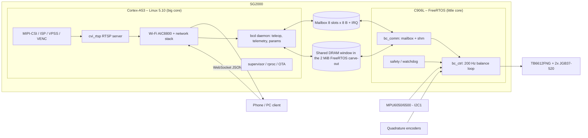
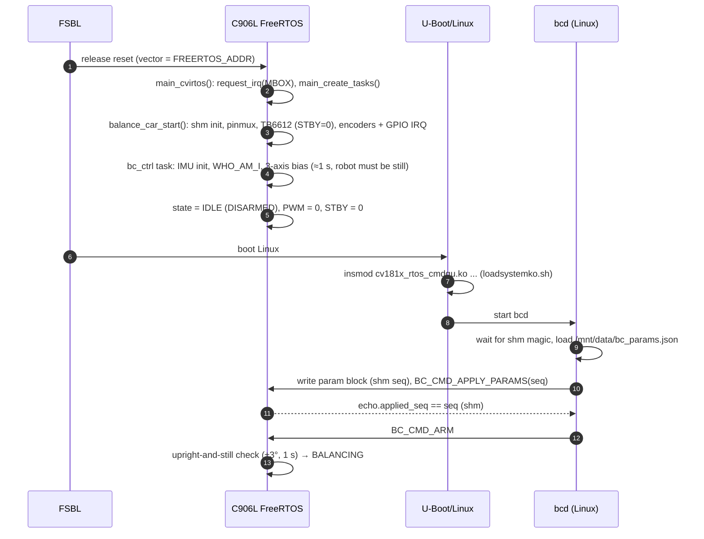
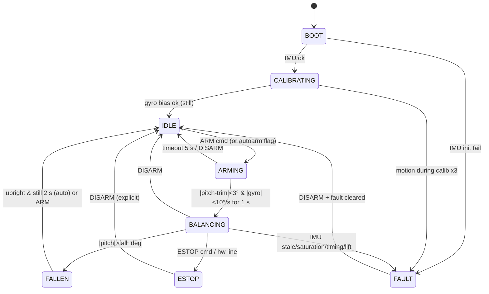

# 01 – System architecture, task schedule and inter-core communication

Scope: Milk-V **DuoS** (SG2000: Cortex-A53 "big" core running Linux, C906L "little" core running
FreeRTOS). This document defines who does what, how the FreeRTOS side is scheduled, and how the two
cores talk to each other.

Conventions used in this document set:

* **[now]** – implemented in this branch. The firmware cross-compiles (CI `fw-build`), the pure logic is
  host-tested, the Linux side is tested against the real C shared-memory code. **Nothing has run on a DuoS
  board yet** – see [06 §0](06-development-roadmap.md) for the verified / unverified split.
* **[plan]** – proposed, not implemented (usually needs hardware or a decision).
* **[est]** – an estimate or assumption that must be measured on hardware (see
  [05-test-plan-and-ci.md](05-test-plan-and-ci.md)).

---

## 1. Design principles

| # | Principle | Consequence |
|---|-----------|-------------|
| P1 | **The car must stay upright with Linux hung, rebooting or Wi-Fi gone.** | All of IMU, encoders, PID, PWM and fall detection live on the C906L. Linux only *requests* setpoints. |
| P2 | **Hard real-time on one core, soft real-time on the other.** | No Linux code in the balance loop; no video, networking or filesystem code on the C906L. |
| P3 | **Single writer per datum.** | Each shared-memory field is written by exactly one core; the other only reads. Avoids locks across cores. |
| P4 | **Fail-safe defaults.** | Any lost heartbeat, bad sensor or out-of-range command degrades to "stand still" or "coast", never to "keep last command". |
| P5 | **Everything tunable at run time, nothing tunable by recompiling.** | Gains and limits live in a parameter block pushed from Linux (see §6.4). |
| P6 | **Pure logic is hardware-independent and unit tested on the host.** | `pid`, `encoder` decode, estimator and mixers contain no MMIO; they run in CI (see doc 05). |

## 2. Hardware and ownership map

### 2.1 Peripheral ownership (exclusive – never share between cores)

| Peripheral | Owner | Linux must… | Source of truth |
|------------|-------|-------------|-----------------|
| I2C for the MPU – **[now]** I2C0 on `IIC0_SCL/SDA` (`BC_MPU_I2C_ID = 0`; set 1 for `PAD_MIPIRX4P/N`, which blocks the 15-pin camera) | C906L | `&i2c0` stays disabled (already so on DuoS); I2C2/I2C3 are camera buses. **Unverified on hardware:** that the IIC0 pads reach the DuoS header | `board_pins.h`, DuoS DTS |
| `VIVO_D0..D8` (encoders, direction, STBY) | C906L | U-Boot (`cvi_board_init.c`) muxes `VIVO_D0/D1` as I2C4 (touch panel) and `VIVO_D5..D8` as SPI3; **[now]** `&i2c4` and `&spi3` are `disabled` in all four DuoS DTS (the touch panel/spidev on those pads no longer work in this image) | `board_pins.c`, DTS |
| PWM0 ch1/ch2 (`VIVO_D10/D9`) | C906L | `duo-init.sh` **[now]** no longer loads `cv181x_pwm.ko` | `hw_pwm.c` |
| XGPIOB 13–21 (`VIVO_D0..D8`) | C906L | never `echo N > /sys/class/gpio/export` for GPIO numbers 461–469 (Linux base 448 + n) | `board_pins.h` |
| MIPI-RX / CSI (J1 16-pin: lanes 2/0/1, I2C3, MCLK0, reset `XGPIOA_2`; J2 15-pin: lanes 5/3/4, I2C2, MCLK1, reset `XGPIOA_4`), ISP, VENC, DWA, VPSS | Linux | one connector active at a time ([02 §3](02-video-streaming-wifi.md)); the RTOS must not touch I2C2/I2C3, `CAM_MCLK*`, `XGPIOA_2/4` | `cvi_mpi`, `loadsystemko.sh`, `sensor_cfg*.ini` |
| SDIO Wi-Fi (AIC8800D80), BT UART | Linux | – | `duo-init.sh` |
| UART used for RTOS console (`printf`) | C906L | not open it as a TTY | `FreeRTOSConfig.h`, uart driver |
| Mailbox `0x01900000`, spinlocks | shared, protocol-arbitrated | use the `rtos_cmdqu` driver only | `rtos_cmdqu.h` |

> **R1 – resolved by the camera layout (see [02 §3](02-video-streaming-wifi.md)): the IMU must leave
> `PAD_MIPIRX4P/N`.** The DuoS has two CSI connectors and both must be usable (one at a time). From
> `device/generic/rootfs_overlay/duos/mnt/data/sensor_cfg_*.ini`: the 16-pin connector (J1, GC2083) uses CSI
> lane pads 2/0/1, the 15-pin Raspberry-Pi-style connector (J2, OV5647/IMX219) uses lane pads **5/3/4** –
> and pad 4 is `PAD_MIPIRX4P/N`, the pair the current firmware uses as I2C1. So with the IMU where it is,
> J2 cannot work. **Decision [plan]:** move the IMU to **I2C0** (`IIC0_SCL/SDA`; the HAL already has
> `PINMUX_I2C0`, U-Boot parks these pads as `XGPIOA_28/29`, and the DuoS DTS has `&i2c0` disabled, so Linux
> does not use them). Still to confirm on the schematic: that the I2C0 pads are routed to the 40-pin
> header on the DuoS, and the clock-gate bits for I2C0 (current code enables the I2C1 gates). I2C2/I2C3 are
> *not* candidates: they carry the camera sensors (J2 and J1). Code change is limited to `BC_MPU_I2C_ID`,
> `board_pins_init()` and the clock enables.

### 2.2 Memory map (DuoS, 512 MiB DDR)

| Region | Address | Size | Owner |
|--------|---------|------|-------|
| Linux RAM | `0x8000_0000` | 510 MiB (`DRAM_SIZE - FREERTOS_SIZE`) | Linux |
| ION (video buffers) | `FREERTOS_ADDR - 170 MiB` | 170 MiB | Linux/VPSS/VENC |
| **FreeRTOS carve-out** (`no-map` in DTS) | `0x9FE0_0000` | 2 MiB | C906L |
| ↳ text/data/bss/stacks/heap | start of carve-out | **measured** (CI build, DuoS): text 99 KB, data 0.8 KB, bss 708 KB (includes the 650 KiB FreeRTOS heap and 128 KiB boot stack); image ends at `0x9FEC5580` | C906L |
| ↳ **bc_shm window** | `0x9FFF_0000` | 64 KiB (top of carve-out); ≈ 1.2 MiB of headroom remain between the image end and the window | shared (see §6) |

`cv181x_lscript.ld` defines `_bc_shm_base = ORIGIN + LENGTH - 0x10000` and
`ASSERT(_end <= _bc_shm_base)`, so growth of the image into the window fails the link instead of silently
corrupting the shared data. Linux maps the window through `/dev/mem` (`CONFIG_STRICT_DEVMEM` is not set in the
DuoS kernel config).

## 3. Division of labour

### 3.1 Cortex-A53 / Linux

| Function | Component | Notes |
|----------|-----------|-------|
| Wi-Fi (STA or AP), IP stack | `aic8800_bsp.ko`, `aic8800_fdrv.ko`, `wpa_supplicant`, `dnsmasq` | Already in `duo-init.sh` / defconfig. `hostapd` is *not* in the DuoS defconfig – add if AP mode is wanted. |
| Camera → H.264/H.265 → RTSP | `cvi_mpi` (VI/ISP/VPSS/VENC), `cvi_rtsp` | See [02](02-video-streaming-wifi.md). |
| Teleoperation server | `bcd` **[now]** (Python 3, WebSocket + web UI on :8080) | Receives joystick, sends telemetry JSON, owns the heartbeat to the RTOS. |
| Parameter store & tuning UI | `bcd`/`bcctl` + `/mnt/data/bc_params.json` **[now]** | Pushes parameter block into `bc_shm` at start and on change. |
| Telemetry logging | `bcd` → CSV/JSONL on SD | 50 Hz decimated records. |
| Firmware lifecycle | `rproc-start.sh`, `burnd`, `/lib/firmware/*.elf` | Reload the RTOS image without reboot **only while disarmed**. |
| Supervisor | `bcd` watchdog thread | Detects RTOS heartbeat loss → log, optionally `rproc` restart. |
| AI features (follow-me, obstacle detection) | `tdl_sdk`, TPU | Produce *velocity/turn requests* only; they never bypass the RTOS limits. |

### 3.2 C906L / FreeRTOS

| Function | Module | Rate |
|----------|--------|------|
| IMU read + estimator | `mpu60x0.c` (+ planned `estimator.c`) | 200 Hz |
| Encoder decode + wheel speed | `encoder.c` (planned: IRQ based) | decode ≥ 10 kHz edge capability, speed at 200 Hz |
| Cascaded PID | `pid.c`, `balance_main.c` | angle 200 Hz, speed 50–200 Hz, turn 200 Hz |
| Motor driver | `tb6612.c`, `hw_pwm.c` | 20 kHz PWM, duty update at 200 Hz |
| Safety | fall/lift/IMU-fault/heartbeat/saturation | every control cycle |
| Mailbox/shm service | `bc_comm` **[plan]** | command: event driven; telemetry: 50 Hz |
| Console | `printf` | rate limited, never from the control path **[plan]** |

### 3.3 What must **not** cross the boundary

* No raw IMU samples at 200 Hz over the mailbox (8 slots only) – use the shm ring, decimated.
* No PID gains hard-coded in either core – single parameter block.
* No Linux-side decision that is needed for staying upright.

## 4. Boot and start-up sequence

Two ways to get the RTOS image running; both end at the same `main_cvirtos()`.

| Mode | Used for | Mechanism |
|------|----------|-----------|
| **FSBL-loaded** `cvirtos.bin` in the FIP | production | FSBL programs C906L reset vector to `FREERTOS_ADDR` and releases reset before Linux boots. |
| **remoteproc** `echo start > /sys/class/remoteproc/remoteproc0/state` | development | `cvitek_remoteproc.c` loads the ELF from `/lib/firmware`, pulses `C906L_CLK_RST_BIT` (SEC_SYS regs are *not* touched from Linux on aarch64). Helper: `device/generic/br_overlay/common/usr/bin/rproc-start.sh`. |

**[now]** Boot always ends in `IDLE` (motors off, `STBY` low). Arming requires the `BC_CMD_ARM` command and the
upright-and-still check; there is no auto-arm and no UART shell yet (the RTOS has no RX path, a developer
convenience left for later). The generic `SYS_CMD_INFO_LINUX_INIT_DONE` handshake is **not** used: `bcd` simply
waits for the shared-memory magic (`'BCSM'`, written last by `bc_shm_init`) and then pushes parameters.
`balance_car_start()` initialises the shared window *first*, so Linux can see the RTOS (state `BOOT`/`FAULT`)
even if the IMU is missing; a re-load of the RTOS without a reboot increments `boot_count`.

## 5. FreeRTOS scheduling

Kernel facts (`freertos/cvitek/kernel/include/riscv64/FreeRTOSConfig.h`): preemptive, tick **200 Hz (5 ms)**,
`configMAX_PRIORITIES = 8`, timer task at priority 7, heap 650 KiB, minimal stack 1024 words, RV64
`imafdc`/`lp64d` (hardware double-precision FPU). `INCLUDE_uxTaskGetStackHighWaterMark` was added for the
stack telemetry.

### 5.1 Task set [now]

| Task | Priority | Stack | Behaviour |
|------|----------|-------|-----------|
| `bc_ctrl` (`balance_ctrl_task`) | idle+6 | 4×min | **blocks** in `vTaskDelayUntil(1 tick)`; one control cycle per tick, measured `dt`; the only hard real-time task |
| `CMDQU` (existing) | idle+5 | 1×min | mailbox dispatcher; unchanged |
| `BALANCE` (`prvBalanceCommTask`) | idle+4 | 2×min | blocks on the `E_QUEUE_BALANCE` queue; handles Linux commands (created by `comm_main.c`, queue length 16) |
| `RGN`, `AUDIO` (existing) | idle+3 | – | still created by the image; they now get CPU because `bc_ctrl` no longer busy-waits |
| `bc_console` | idle+2 | 3×min | wakes every 100 ms, prints state changes/events from the shm ring and a 1 Hz status line – **`printf` never runs in `bc_ctrl`** |
| Timer task (FreeRTOS) | 7 | 2×min | unchanged |
| encoder GPIO ISR | PLIC irq 42 (`GPIO1_INTR_FLAG`) | – | both-edge interrupts on the four encoder pins; body = clear status, decode both encoders (a few µs) |
| mailbox ISR (existing) | irq 61 | – | `prvQueueISR` now also routes `IP_BALANCE` |

Deviation from the first design: **no dedicated hardware-timer ISR**. The control task is paced by the 200 Hz
tick (decision D6 in [06](06-development-roadmap.md): keep the global tick semantics). The actual period is
measured every cycle (`period_us`, `exec_us` are in each telemetry record, `deadline_miss` counts periods
> 7.5 ms), so tick jitter is visible rather than assumed away; a HW-timer-driven variant stays an option if
`HIL-07` shows more than ±0.1 ms.

What changed relative to the first firmware version: busy-wait loop → blocking task (S4); `printf` removed from
the loop (S5); encoders from edge interrupts instead of polling between I2C transfers (S6, selectable with
`BC_ENC_USE_IRQ`); PWM update-in-place quirk (S12) is **not** changed yet.

### 5.2 Control cycle (`bc_ctrl`, every 5 ms) [now]

| Step | Action |
|------|--------|
| 1 | `vTaskDelayUntil`; `period_us` from `rdtime`; `dt = clamp(period, 2 ms, 10 ms)`; deadline accounting |
| 2 | (polling fallback only: `encoder_poll` ×2) · IMU 14-byte burst read; scale (±2 g, ±500 °/s), boot bias removed |
| 3 | command snapshot from the comm task + Linux heartbeat (shm word, 20 Hz, and mailbox) → `bc_cmd_effective()`: clamp, timeout → 0 |
| 4 | events (ARM/DISARM/ESTOP/…) and pending parameter set (applied here, echoed to shm) |
| 5 | **`bc_core_step()`**: IMU health → estimator → state machine → (BALANCING only) speed PI → angle PD → turn PI → mixer/deadband → motor sign |
| 6 | actuators: BALANCING → `STBY=1` + direction pins + PWM; every other state → coast + `STBY=0` (also refreshed every 100 ms) |
| 7 | runtime calibration requests (gyro / level trim) – only while `IDLE`; cadence restarted afterwards |
| 8 | state-change events → shm event ring; status words every cycle; heartbeat 10 Hz; **telemetry record every 4th cycle (50 Hz)** |

Step 5 is hardware independent and is exactly the code the host tests and the closed-loop simulation run
(`bc_core.c`); steps 1–4, 6–8 are the thin I/O shell in `balance_main.c`.

## 6. Inter-core communication

| Layer | Capacity | Direction | Used for |
|-------|----------|-----------|----------|
| **L1 Mailbox / `cmdqu_t`** | 8 slots × 8 B, hardware IRQ | Linux → RTOS (RTOS → Linux optional, off) | commands, heartbeat |
| **L2 Shared memory `bc_shm_t`** | 64 KiB window | both, single writer per cache line | parameters, telemetry ring, event ring, status, heartbeats |
| **L3 UART console** | 115 200 baud | RTOS → human | boot log, 1 Hz status; not a machine interface |

### 6.1 L1 – mailbox protocol [now]

`cmdqu_t` is exactly 8 bytes; `resv` is used by the mailbox validity handshake, so the usable payload is the
32-bit `param_ptr`. Linux sends through `/dev/cvi-rtos-cmdqu` (`ioctl(RTOS_CMDQU_SEND = 0x40087201, &cmdqu_t)`,
the existing driver); the RTOS ISR copies the message and routes by `ip_id`.

Changes made to the existing code: `IP_BALANCE = 8` in both copies of `rtos_cmdqu.h`
(`freertos/…/rtos_cmdqu.h`, `osdrv/interdrv/rtos_cmdqu/rtos_cmdqu.h`); `E_QUEUE_BALANCE` in `comm_def.h`; a
`BALANCE` entry in `gTaskCtx[]` (only runs when the image is built for `cv181x`); `case IP_BALANCE` in `prvQueueISR`.

| `cmd_id` | Name | `param_ptr` | Effect |
|----------|------|-------------|--------|
| 0x01 | `BC_CMD_PING` | nonce | logs `BC_EVT_LOG_PONG` (val = nonce, RTOS timestamp) to the event ring – used to measure latency |
| 0x02 / 0x03 | `BC_CMD_ARM` / `BC_CMD_DISARM` | – | event bit for the state machine |
| 0x04 | `BC_CMD_SET_TARGET` | `int16 speed [mm/s]` \| `int16 turn [mrad/s]` << 16 | new target (fire-and-forget, repeated at 20 Hz) |
| 0x05 | `BC_CMD_APPLY_PARAMS` | shm parameter-block sequence | RTOS reads + validates the block, queues it, replies by logging `BC_EVT_LOG_PARAMS` (arg = 0 ok, else 1 + bad field / 101 torn / 102 crc-size-version) |
| 0x06 | `BC_CMD_HEARTBEAT` | counter | refreshes the heartbeat watchdog |
| 0x07 | `BC_CMD_CALIBRATE` | 1 gyro, 2 level trim | honoured only in `IDLE` |
| 0x08 | `BC_CMD_ESTOP` | – | latched `ESTOP` state |
| 0x40–0x45 | `BC_EVT_*` | – | RTOS → Linux events. **Disabled by default (`BC_MBOX_EVENTS = 0`)**: the stock Linux driver logs an error for every message whose `ip_id` has no registered handler. All events are in the shm event ring instead; flip the flag once a Linux handler is registered with `request_rtos_irq(IP_BALANCE, …)`. |

Delivery semantics: setpoints are idempotent and periodic; `ARM/DISARM/ESTOP/APPLY_PARAMS` are confirmed by the
state in shm (`status.state`, event ring, `echo.applied_seq`) – `bcd` waits for the echo (1 s) and reports
failure. Unknown commands increment `status.lost_cmds`.

### 6.2 L2 – shared-memory layout `bc_shm_t` [now]

`include/bc_shm.h` (`_Static_assert`s check every offset); mirrored by the generated
`bc_layout.py` (CI regenerates it and a test compares it with the C compiler's offsets).

| Offset | Size | Writer | Content |
|--------|------|--------|---------|
| 0x0000 | 64 B | RTOS (once, magic last) | `magic 'BCSM'`, `version`, `size`, `boot_count`, `build_id[16]` |
| 0x0040 | 64 B | RTOS | status: `rtos_heartbeat` (10 Hz), `state`, `fault`, `deadline_miss`, `imu_err`, `cpu_load_pct` (load of the `bc_ctrl` task = execution time / period, smoothed; **not** whole-CPU load because the idle hook is not enabled), `imu_variant` (0 unknown, 1 MPU6050, 2 MPU6500 family), `telem_head`, `event_head`, `cycles`, `lost_cmds`, `stack_min[4]` |
| 0x0080 | 64 B | **Linux** | `linux_heartbeat` (10 Hz), `linux_flags` |
| 0x0100 | ≤ 1 KiB | **Linux** | parameter block (seqlock): `seq`, `crc32`, `version`, `size`, `bc_params_t` |
| 0x0500 | ≤ 256 B | RTOS | parameter echo (what is actually in use): `seq`, `applied_count`, `last_result`, `applied_seq`, `bc_params_t` |
| 0x0600 | 512 B | RTOS | calibration block (seqlock): `seq`, `valid`, `gyro_bias[3]` (°/s), `accel_mean[3]` (g), `trim_deg`, `temp_c`; written after boot calibration and after every runtime calibration; read by `Shm.read_calib()`, shown in `bcctl status` and `/api/status` |
| 0x0800 | 16 KiB | RTOS | telemetry ring: 256 × 64 B at 50 Hz (≈ 5 s of history) |
| 0x4800 | 4 KiB | RTOS | event ring: 128 × 32 B (state changes, commands, parameter results, calibration) |
| 0x5800 | 42 KiB | – | reserved |

Telemetry record (64 B): `seq` (2n+2 when stable), `t_us`, pitch / accel-pitch / gyro-y / gyro-z (0.01 units),
accel norm [mg], wheel speeds [mm/s], angle command, motor demand [‰], targets, raw encoder counts,
`vbat_mv` (0: no ADC yet), `exec_us`, `period_us`, state, fault, `imu_err`, flags (gated, targets zeroed, hb lost,
saturated), CRC-32 over bytes 4–59.

### 6.3 Memory-ordering and cache rules [now]

The C906L and the A53 have independent caches; only the mailbox synchronises them.

| Rule | Detail |
|------|--------|
| W1 | **One writer per 64-byte cache line.** The RTOS never *cleans/flushes* a line Linux writes (a write-back would clobber Linux data); it only *invalidates* before reading (`inv_dcache_range` – param block, `linux_heartbeat`). Linux-written lines (0x80, 0x100…) are separate from every RTOS-written line. |
| W2 | RTOS writers use `clean_dcache_range` after finishing a record (`BC_SHM_CLEAN`); records use a **seqlock** (odd = being written, `2n+2` = stable) and a CRC so readers detect torn reads. |
| W3 | Linux maps the window with `/dev/mem` + `O_SYNC` (device/non-cacheable on arm64) – no cache maintenance needed, only in-order stores. |
| W4 | Parameters are applied atomically at a control-cycle boundary after validation (range, finite, ±1 for signs, CRC, version); on failure the old set stays and the result code is reported. |
| W5 | Readers detect overrun (`head − n > slots`) and count `lost`; the RTOS never waits for Linux. |
| W6 | `bc_shm_init` zeroes the whole window once at RTOS start; Linux must not write before it sees the magic. |

Verified by: 11 host tests in `test_shm.c` (two-thread seqlock stress with 300 000 records, corruption, overrun,
wrap, parameter block) and the Python↔C interop tests.

### 6.4 Parameter block (single source of truth) [now]

All fields are 32-bit (43 parameters; the table lists them in the order of the struct); list, ranges and defaults come from one X-macro in `include/bc_params.h`
(`bc_params_t`, `bc_param_table`, validation). Board-level sign overrides live in `board_pins.h`
(`BC_BOARD_*_SIGN`); every value can be changed at run time from Linux (`bcctl set`, WebSocket `param`).

| Name | Type | Default | Range | Meaning |
|------|------|---------|-------|---------|
| `est_alpha` | float | 0.998 | 0.9 … 0.9999 | complementary gyro weight (τ = α·dt/(1−α) = 2.5 s) |
| `est_gate_g` | float | 0.1 | 0 … 1 | accel-norm gate, 0 = off |
| `est_bias_gain` | float | 0.02 | 0 … 1 | online gyro-bias gain [1/s] |
| `a_kp` | float | 15 | 3.5 … 60 | % per deg |
| `a_kd` | float | 0.8 | 0 … 5 | % per (deg/s), applied to the gyro rate |
| `a_ki` | float | 0 | 0 … 5 | % per (deg·s), normally 0 |
| `trim_deg` | float | 0 | -15 … 15 | mechanical balance point |
| `a_out_max` | float | 90 | 20 … 100 | angle-loop output limit [%] |
| `v_kp` | float | 1.94 | 0 … 8 | deg per (m/s), magnitude (loop applies the sign) |
| `v_ki` | float | 1.94 | 0 … 8 | deg per m |
| `v_max_deg` | float | 8 | 0 … 20 | speed-loop lean limit |
| `v_filter` | float | 0.3 | 0.01 … 1 | wheel-speed low-pass |
| `t_kp` | float | 5 | 0 … 30 | % per (rad/s) yaw rate |
| `t_ki` | float | 5 | 0 … 30 |  |
| `t_max` | float | 20 | 0 … 50 | turn authority [%] |
| `t_speed_scale` | float | 0.5 | 0.05 … 5 | turn authority shrinks above this speed [m/s] |
| `deadband_pct` | float | 6 | 0 … 20 | motor dead zone compensation |
| `motor_max_pct` | float | 90 | 20 … 100 |  |
| `acc_max` | float | 0.5 | 0.05 … 5 | target slew [m/s²] |
| `alpha_max` | float | 3 | 0.1 … 20 | yaw target slew [rad/s²] |
| `v_max` | float | 0.5 | 0 … 2 | [m/s] |
| `w_max` | float | 2 | 0 … 6 | [rad/s] |
| `fall_deg` | float | 45 | 20 … 80 |  |
| `lift_speed_mps` | float | 1.5 | 0.3 … 5 |  |
| `sat_ms` | float | 300 | 50 … 5000 | saturation fault time |
| `cmd_timeout_ms` | float | 500 | 100 … 10000 | target / heartbeat timeout → targets forced to 0 |
| `hb_disarm_ms` | float | 0 | 0 … 600000 | Linux silent this long → DISARM (0 = never) |
| `wheel_diam_m` | float | 0.065 | 0.02 … 0.3 |  |
| `track_m` | float | 0.17 | 0.05 … 0.6 |  |
| `enc_cpr` | float | 3960 | 100 … 100000 | counts per wheel revolution |
| `imu_sign` | sign | 1 | -1 … 1 | flips angle and rate together |
| `motor_sign_l` | sign | 1 | -1 … 1 |  |
| `motor_sign_r` | sign | 1 | -1 … 1 |  |
| `enc_sign_l` | sign | 1 | -1 … 1 |  |
| `enc_sign_r` | sign | 1 | -1 … 1 |  |
| `est_mode` | int | 0 | 0 … 1 | 0 = gated complementary, 1 = robust Kalman |
| `est_spike_deg` | float | 20.0 | 0.0 … 90.0 | accel-angle spike rejection [deg], 0 = off |
| `kf_q_angle` | float | 0.001 | 1e-06 … 1.0 | Kalman process noise, angle |
| `kf_q_bias` | float | 0.003 | 1e-06 … 1.0 | Kalman process noise, gyro bias |
| `kf_r` | float | 3.0 | 0.0001 … 10.0 | Kalman measurement noise [deg²], inflated with the innovation |
| `kf_robust_deg` | float | 3.0 | 0.0 … 30.0 | innovation scale of the robust inflation [deg] |
| `x_kp` | float | 0.0 | 0.0 … 3.0 | position-hold gain [1/s], 0 = off |
| `x_vmax` | float | 0.15 | 0.02 … 1.0 | position-hold speed cap [m/s] |

Defaults are the simulation-derived starting point from [04](04-pid-and-motion-control.md); they are *not* tuned
on a real chassis.

## 7. Safety architecture

### 7.1 State machine (RTOS-owned)

Outputs by state: `BALANCING` → PID outputs; every other state → `tb6612_coast()` + `STBY=0`
(**[now]**: STBY is cleared only on the fall path).

### 7.2 Fault table

| Fault | Detection | Action | Latched? |
|-------|-----------|--------|----------|
| `FALL` | `|pitch| > 45°` | coast, STBY=0, → FALLEN | no (auto re-arm optional) |
| `LIFT` | wheel speed > `lift_speed_mps` for 200 ms while `|pitch| < 10°`, or both wheels saturate | coast | until DISARM |
| `IMU_BUS` | I2C error 3 cycles in a row | coast, FAULT, bus recovery (≤ 9 SCL clocks + STOP, once per second while not balancing, then IMU re-init; unverified on hardware) | until DISARM |
| `IMU_STUCK` | identical 14-byte frame ×20 | same | until DISARM |
| `IMU_RANGE` | gyro raw at ±32767 for >3 cycles; accel norm outside 0.5–1.5 g for >100 ms | same | until DISARM |
| `SATURATION` | `|u| ≥ out_max` continuously > `sat_ms` | coast | until DISARM |
| `TIMING` | 3 deadline misses in 1 s | coast | until DISARM |
| `HB_LOST` | no Linux heartbeat / target for `cmd_timeout_ms` (500 ms) | **targets → 0 (keep balancing)** [now]; `hb_disarm_ms` > 0 adds an optional DISARM [now] | auto-clear |
| `PARAM` | param block failed validation | keep old params, report | no |
| `ESTOP` | command or hardware line | coast | until DISARM |
| `RTOS_DEAD` | **Linux** sees `rtos_heartbeat` frozen for 300 ms (RTOS crashed/halted, e.g. `remoteproc stop`) | Linux **emergency path** [now, in `bcd.py`]: clear the `STBY` bit in the GPIOB data register via `/dev/mem` (single documented exception to P3, §7.3), once per freeze, re-armed when the heartbeat resumes | until reboot / re-arm |

### 7.3 Hardware kill path and the "dead RTOS" problem

If the C906L crashes or is stopped, the PWM block and the GPIO output latches are expected to **keep their
last values** (peripheral state does not depend on the CPU – to be confirmed by test `SAF-08`). The car
would then keep driving at the last duty. Two independent mitigations:

1. **Linux emergency path [now]:** `bcd` watches `rtos_heartbeat`; if it stops for 300 ms it clears the
   `STBY` bit (`GPIOB` data register, bit 15) with a direct register write. This is the only place where
   Linux touches an RTOS-owned pin; it is idempotent, one-way (towards the safe state) and documented in
   the code. It does not help if Linux is also dead.
2. **Hardware [recommended]:** put `STBY` behind a retriggerable one-shot / supervisor IC that the RTOS
   keeps alive with its heartbeat toggle (or at least a pull-down so STBY is low whenever the pad is
   not actively driven high), so a hung system of either core stops the motors.

Wire TB6612 `STBY` through a pull-down so the motors are off when the C906L is not driving the pin
(already true while pads are in reset – verify on the board), and optionally add an **e-stop button
to a spare GPIO read by the RTOS** with a 5 ms debounce in `bc_ctrl`. Software e-stop through Linux is
a convenience, never the only safety mechanism.

## 8. Bring-up order (architecture view)

1. RTOS standalone: UART log, state machine, IMU reading, no motors (wheels lifted).
2. Add motors + encoders, sign calibration ([04 §7](04-pid-and-motion-control.md)).
3. Closed loop on a stand, then on the floor, with Linux idle.
4. Add mailbox commands and shm telemetry; `bcd` with CLI only.
5. Add Wi-Fi teleop.
6. Add video and re-run the jitter test with the encoder at full load.

Each step has an exit test in [05](05-test-plan-and-ci.md).
