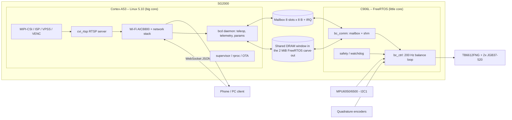
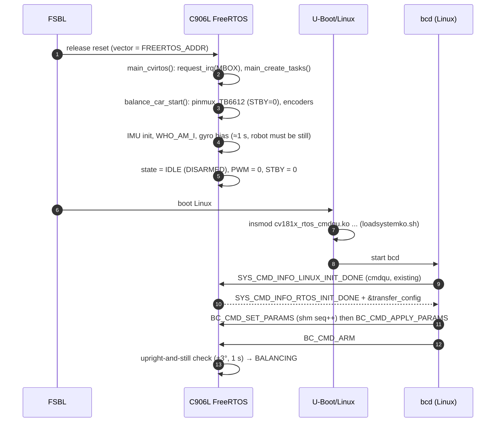
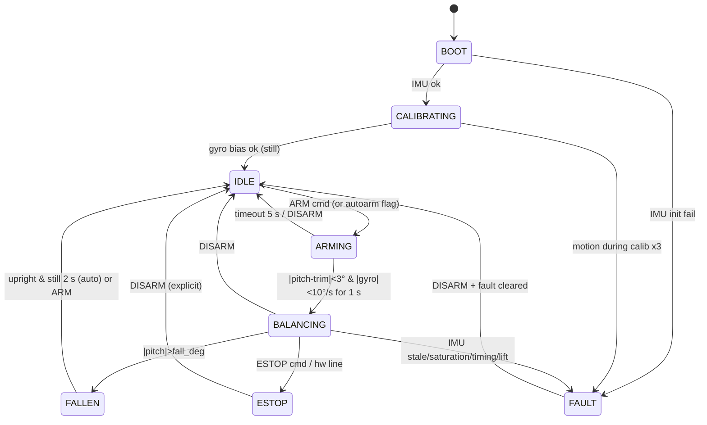

# 01 – System architecture, task schedule and inter-core communication

Scope: Milk-V **DuoS** (SG2000: Cortex-A53 "big" core running Linux, C906L "little" core running
FreeRTOS). This document defines who does what, how the FreeRTOS side is scheduled, and how the two
cores talk to each other.

Conventions used in this document set:

* **[now]** – behaviour that exists in the tree today (`freertos/cvitek/task/balance_car`).
* **[plan]** – proposed design, not implemented yet.
* **[est]** – an estimate or assumption that must be measured on hardware (see
  [05-test-plan-and-ci.md](05-test-plan-and-ci.md)).

---

## 1. Design principles

| # | Principle | Consequence |
|---|-----------|-------------|
| P1 | **The car must stay upright with Linux hung, rebooting or Wi-Fi gone.** | All of IMU, encoders, PID, PWM and fall detection live on the C906L. Linux only *requests* setpoints. |
| P2 | **Hard real-time on one core, soft real-time on the other.** | No Linux code in the balance loop; no video, networking or filesystem code on the C906L. |
| P3 | **Single writer per datum.** | Each shared-memory field is written by exactly one core; the other only reads. Avoids locks across cores. |
| P4 | **Fail-safe defaults.** | Any lost heartbeat, bad sensor or out-of-range command degrades to "stand still" or "coast", never to "keep last command". |
| P5 | **Everything tunable at run time, nothing tunable by recompiling.** | Gains and limits live in a parameter block pushed from Linux (see §6.4). |
| P6 | **Pure logic is hardware-independent and unit tested on the host.** | `pid`, `encoder` decode, estimator and mixers contain no MMIO; they run in CI (see doc 05). |

## 2. Hardware and ownership map



### 2.1 Peripheral ownership (exclusive – never share between cores)

| Peripheral | Owner | Linux must… | Source of truth |
|------------|-------|-------------|-----------------|
| I2C for the MPU – **[now]** I2C1 on `PAD_MIPIRX4P/N`; **[plan]** I2C0 on `IIC0_SCL/SDA` | C906L | keep `&i2c0` disabled (already so on DuoS); set `&i2c1` disabled while the IMU is on it **[now: DTS has `okay`]** | `board_pins.h`, DuoS DTS |
| `VIVO_D0..D8` (encoders, direction, STBY) | C906L | **[now: conflict]** U-Boot (`cvi_board_init.c`) muxes `VIVO_D0/D1` as I2C4 (touch panel) and `VIVO_D5..D8` as SPI3, and the DuoS DTS enables `&i2c4` (gt9xx) and `&spi3`; disable both nodes in the balance image or move the signals | `board_pins.c`, DTS |
| PWM0 ch1/ch2 (`VIVO_D10/D9`) | C906L | not `insmod cv181x_pwm.ko` **[now: `duo-init.sh` loads it]** or not export those channels | `hw_pwm.c` |
| XGPIOB 13–21 (`VIVO_D0..D8`) | C906L | never `echo N > /sys/class/gpio/export` for GPIO numbers 461–469 (Linux base 448 + n) | `board_pins.h` |
| MIPI-RX / CSI (J1 16-pin: lanes 2/0/1, I2C3, MCLK0, reset `XGPIOA_2`; J2 15-pin: lanes 5/3/4, I2C2, MCLK1, reset `XGPIOA_4`), ISP, VENC, DWA, VPSS | Linux | one connector active at a time ([02 §3](02-video-streaming-wifi.md)); the RTOS must not touch I2C2/I2C3, `CAM_MCLK*`, `XGPIOA_2/4` | `cvi_mpi`, `loadsystemko.sh`, `sensor_cfg*.ini` |
| SDIO Wi-Fi (AIC8800D80), BT UART | Linux | – | `duo-init.sh` |
| UART used for RTOS console (`printf`) | C906L | not open it as a TTY | `FreeRTOSConfig.h`, uart driver |
| Mailbox `0x01900000`, spinlocks | shared, protocol-arbitrated | use the `rtos_cmdqu` driver only | `rtos_cmdqu.h` |

> **R1 – resolved by the camera layout (see [02 §3](02-video-streaming-wifi.md)): the IMU must leave
> `PAD_MIPIRX4P/N`.** The DuoS has two CSI connectors and both must be usable (one at a time). From
> `device/generic/rootfs_overlay/duos/mnt/data/sensor_cfg_*.ini`: the 16-pin connector (J1, GC2083) uses CSI
> lane pads 2/0/1, the 15-pin Raspberry-Pi-style connector (J2, OV5647/IMX219) uses lane pads **5/3/4** –
> and pad 4 is `PAD_MIPIRX4P/N`, the pair the current firmware uses as I2C1. So with the IMU where it is,
> J2 cannot work. **Decision [plan]:** move the IMU to **I2C0** (`IIC0_SCL/SDA`; the HAL already has
> `PINMUX_I2C0`, U-Boot parks these pads as `XGPIOA_28/29`, and the DuoS DTS has `&i2c0` disabled, so Linux
> does not use them). Still to confirm on the schematic: that the I2C0 pads are routed to the 40-pin
> header on the DuoS, and the clock-gate bits for I2C0 (current code enables the I2C1 gates). I2C2/I2C3 are
> *not* candidates: they carry the camera sensors (J2 and J1). Code change is limited to `BC_MPU_I2C_ID`,
> `board_pins_init()` and the clock enables.

### 2.2 Memory map (DuoS, 512 MiB DDR)

| Region | Address | Size | Owner |
|--------|---------|------|-------|
| Linux RAM | `0x8000_0000` | 510 MiB (`DRAM_SIZE - FREERTOS_SIZE`) | Linux |
| ION (video buffers) | `FREERTOS_ADDR - 170 MiB` | 170 MiB | Linux/VPSS/VENC |
| **FreeRTOS carve-out** (`no-map` in DTS) | `0x9FE0_0000` | 2 MiB | C906L |
| ↳ text/data/bss/stacks/heap | start of carve-out | image size unknown – measure with `size cvirtos.elf`; FreeRTOS heap is 512 or 650 KiB (`configTOTAL_HEAP_SIZE`) | C906L |
| ↳ **bc_shm window [plan]** | `0x9FFF_0000` | 64 KiB (top of carve-out) | shared (see §6) |

`bc_shm` requires the linker script (`freertos/cvitek/scripts/cv181x_lscript.ld`) / heap size to leave
the top 64 KiB untouched; add an assert in the linker script so a heap growth fails the build instead of
silently overwriting the window.

## 3. Division of labour

### 3.1 Cortex-A53 / Linux

| Function | Component | Notes |
|----------|-----------|-------|
| Wi-Fi (STA or AP), IP stack | `aic8800_bsp.ko`, `aic8800_fdrv.ko`, `wpa_supplicant`, `dnsmasq` | Already in `duo-init.sh` / defconfig. `hostapd` is *not* in the DuoS defconfig – add if AP mode is wanted. |
| Camera → H.264/H.265 → RTSP | `cvi_mpi` (VI/ISP/VPSS/VENC), `cvi_rtsp` | See [02](02-video-streaming-wifi.md). |
| Teleoperation server | `bcd` **[plan]** (C or Python 3, WebSocket on :8080) | Receives joystick, sends telemetry JSON, owns heartbeat to RTOS. |
| Parameter store & tuning UI | `bcd` + `/mnt/data/bc_params.json` **[plan]** | Pushes parameter block into `bc_shm` at start and on change. |
| Telemetry logging | `bcd` → CSV/JSONL on SD | 50 Hz decimated records. |
| Firmware lifecycle | `rproc-start.sh`, `burnd`, `/lib/firmware/*.elf` | Reload the RTOS image without reboot **only while disarmed**. |
| Supervisor | `bcd` watchdog thread | Detects RTOS heartbeat loss → log, optionally `rproc` restart. |
| AI features (follow-me, obstacle detection) | `tdl_sdk`, TPU | Produce *velocity/turn requests* only; they never bypass the RTOS limits. |

### 3.2 C906L / FreeRTOS

| Function | Module | Rate |
|----------|--------|------|
| IMU read + estimator | `mpu60x0.c` (+ planned `estimator.c`) | 200 Hz |
| Encoder decode + wheel speed | `encoder.c` (planned: IRQ based) | decode ≥ 10 kHz edge capability, speed at 200 Hz |
| Cascaded PID | `pid.c`, `balance_main.c` | angle 200 Hz, speed 50–200 Hz, turn 200 Hz |
| Motor driver | `tb6612.c`, `hw_pwm.c` | 20 kHz PWM, duty update at 200 Hz |
| Safety | fall/lift/IMU-fault/heartbeat/saturation | every control cycle |
| Mailbox/shm service | `bc_comm` **[plan]** | command: event driven; telemetry: 50 Hz |
| Console | `printf` | rate limited, never from the control path **[plan]** |

### 3.3 What must **not** cross the boundary

* No raw IMU samples at 200 Hz over the mailbox (8 slots only) – use the shm ring, decimated.
* No PID gains hard-coded in either core – single parameter block.
* No Linux-side decision that is needed for staying upright.

## 4. Boot and start-up sequence

Two ways to get the RTOS image running; both end at the same `main_cvirtos()`.

| Mode | Used for | Mechanism |
|------|----------|-----------|
| **FSBL-loaded** `cvirtos.bin` in the FIP | production | FSBL programs C906L reset vector to `FREERTOS_ADDR` and releases reset before Linux boots. |
| **remoteproc** `echo start > /sys/class/remoteproc/remoteproc0/state` | development | `cvitek_remoteproc.c` loads the ELF from `/lib/firmware`, pulses `C906L_CLK_RST_BIT` (SEC_SYS regs are *not* touched from Linux on aarch64). Helper: `device/generic/br_overlay/common/usr/bin/rproc-start.sh`. |



**[now]** `balance_car_start()` arms the motors directly at boot if the IMU init succeeded
(`g_armed = 1`). **[plan]** boot always ends in `IDLE`; arming requires either the `BC_CMD_ARM` command
*or* a local policy flag (`BC_AUTOARM`, default off) plus the upright-and-still check. The RTOS must be
able to run completely standalone (no Linux) for bench work: UART commands `arm`, `disarm`, `set k v`
are a planned developer convenience.

## 5. FreeRTOS scheduling

Kernel facts (from `freertos/cvitek/kernel/include/riscv64/FreeRTOSConfig.h`): preemptive, tick
**200 Hz (5 ms)**, `configMAX_PRIORITIES = 8`, timer task at priority 7, heap 512/650 KiB, minimal
stack 1024 words, RV64 `imafdc` / `lp64d` (hardware double-precision FPU is available).

### 5.1 [now] task set

| Task | Priority | Stack | Behaviour |
|------|----------|-------|-----------|
| `balance` (`balance_ctrl_task`) | idle+5 | 4×min | **Never blocks**: polls encoders, `udelay(40)`, `continue`s until `now - last ≥ 1 tick`. |
| `CMDQU` | idle+5 | 1×min | Blocks on queue; handles `IP_SYSTEM` commands. |
| ISP/VCODEC/VI/CAMERA/RGN | idle+3 | – | Queues exist; only RGN and AUDIO have run functions in this image. |
| AUDIO | idle+3 | 15×min | Present in the image. |
| Timer task | 7 | 2×min | FreeRTOS software timers. |

Consequences of the current design (details in [06 §2](06-development-roadmap.md)):

1. Control period is **exactly one 5 ms tick**; the loop actually runs whenever the busy-wait notices a
   tick change, so jitter is `tick phase + printf blocking + I2C time`, and `dt` is assumed constant.
2. A never-blocking task at idle+5 starves everything below it (audio, RGN, idle task) – tolerable
   only because those are unused here.
3. A blocking `printf` of a ≈110-char line at 115 200 baud takes ≈ 10 ms **[est]**, longer than one
   control period. It runs every 2 s inside the loop.
4. Encoders are only sampled between I2C transfers; a 14-byte I2C read at 400 kHz takes ≈ 0.4 ms
   **[est]**, during which edges are lost.

### 5.2 [plan] target task set

```
priority
  7  Timer task (FreeRTOS)                   – unchanged
  6  bc_ctrl      200 Hz, notified by HW timer ISR  – the ONLY hard real-time task
  5  CMDQU        existing mailbox dispatcher       – blocks on queue
  4  bc_comm      event + 50 Hz telemetry publisher – blocks on queue/timer
  3  (ISP/VI/VCODEC/RGN/AUDIO – not created in the balance image)
  2  bc_console   drains log ring to UART, rate limited
  0  idle (+ idle hook: stack high-water, CPU load, heartbeat toggle)
 ISR  TIMER (200 Hz)  → vTaskNotifyGiveFromISR(bc_ctrl)
 ISR  GPIO (encoder A/B edges, both) → update count, timestamp (≤ 2 µs body)
 ISR  MBOX (existing prvQueueISR) → xQueueSendFromISR(CMDQU/BALANCE queue)
```

| Task | Trigger | WCET budget **[est]** | Stack | Notes |
|------|---------|-----------------------|-------|-------|
| `bc_ctrl` | `ulTaskNotifyTake` from timer ISR | 1.0 ms (I2C 0.4 ms + math 0.05 ms + PWM 0.05 ms + margin) | 4 KiB | Measures its own `dt` from the free-running timer; records `exec_us`, `period_us`, `jitter_us`. |
| `bc_comm` | queue from mailbox ISR; 20 ms periodic timer | 0.3 ms | 2 KiB | Never calls into `bc_ctrl` data except through the lock-free snapshot (§6.3). |
| `bc_console` | log ring non-empty | – | 2 KiB | Drops lines when the ring is full (counter exported in telemetry). |
| idle hook | idle | – | – | Computes CPU load; toggles a status GPIO for scope-based liveness check. |

**Timer source.** Use a dedicated hardware timer (the C906L has the CLINT `mtime`/`mtimecmp` and the
SoC timers used by the RTOS HAL) rather than raising `configTICK_RATE_HZ`, so the rest of the image
keeps its 200 Hz tick semantics. Decision record: if the HAL timer path is awkward, raising the tick
to 1 kHz and using `vTaskDelayUntil(5 ticks)` is an acceptable second choice; verify nothing else in
the image depends on 200 Hz.

**Rules**

* `bc_ctrl` never calls blocking APIs other than its own notify-take; no `printf`, no `malloc`.
* Mutexes are not used across the control path. Shared state between `bc_ctrl` and `bc_comm` uses
  single-writer snapshots with sequence counters.
* Stack high-water marks are exported in telemetry; CI hardware tests fail if any task < 25 % free.
* Deadline miss (period > 7.5 ms or exec > 3 ms) increments `deadline_miss`; 3 misses in 1 s → fault
  `FAULT_TIMING` → disarm.

### 5.3 Control cycle – ordered steps (`bc_ctrl`, every 5 ms)

| Step | Action | Budget **[est]** |
|------|--------|------------------|
| 1 | `t_now = timer_us()`; `dt = clamp(t_now - t_prev, 2 ms, 10 ms)` | 2 µs |
| 2 | IMU burst read (14 B). On failure: `imu_fail++`, reuse last sample for ≤ 2 cycles, then FAULT | 400 µs |
| 3 | Scale, axis-map, bias-correct; estimator → `θ`, `ω` | 20 µs |
| 4 | Snapshot encoder counts; `v_l`, `v_r` (m/s), low-pass; odometry | 10 µs |
| 5 | Read latest command snapshot (target speed/turn, flags); apply watchdog policy | 2 µs |
| 6 | Safety checks (fall, lift, saturation, IMU sanity, timing) → state machine | 5 µs |
| 7 | If BALANCING: speed loop → angle setpoint; angle PD → `u`; turn loop; mix; deadband compensation; clamp | 15 µs |
| 8 | Write STBY/IN pins and PWM duty; if not BALANCING force coast | 50 µs |
| 9 | Fill telemetry slot (every 4th cycle → 50 Hz) and publish with seqlock | 10 µs |

Total ≈ 0.5 ms of the 5 ms budget (≈ 10 % CPU) **[est]**; the I2C transfer dominates and is a polled
busy-wait today. Moving to an IRQ- or DMA-driven read is only worth it if measured jitter requires it.

## 6. Inter-core communication

Three layers, each used for what it is good at:

| Layer | Capacity | Direction | Used for |
|-------|----------|-----------|----------|
| **L1 Mailbox / `cmdqu_t`** | 8 slots × 8 B, hardware IRQ both ways | both | doorbells and small commands (≤ 4 B payload) |
| **L2 Shared memory `bc_shm`** | 64 KiB window | both (single-writer fields) | parameters, telemetry ring, event log, bulk data |
| **L3 UART console** | 115 200 baud | RTOS → human | boot log, developer shell; *not* a machine interface |

### 6.1 L1 – mailbox protocol (existing driver, new IP id)

Existing facts (`freertos/cvitek/driver/rtos_cmdqu/include/rtos_cmdqu.h`, mirrored in
`osdrv/interdrv/rtos_cmdqu/rtos_cmdqu.h`):

```c
struct cmdqu_t {            /* exactly 8 bytes, packed */
    uint8_t  ip_id;         /* routes to a FreeRTOS queue                      */
    uint8_t  cmd_id : 7;
    uint8_t  block  : 1;    /* sender waits for a reply                        */
    union { struct { uint8_t linux_valid, rtos_valid; } valid;  /* set by the   */
            uint16_t mstime; } resv;                            /* mailbox code */
    uint32_t param_ptr;     /* 32-bit payload or physical address              */
};
```

* `resv` is consumed by the slot-validity handshake, so **the only usable payload is the 32-bit
  `param_ptr`**.
* Linux side: `/dev/cvi-rtos-cmdqu`, ioctls `RTOS_CMDQU_SEND`, `RTOS_CMDQU_SEND_WAIT`; in-kernel
  `rtos_cmdqu_send()` / `request_rtos_irq(ip_id, handler, …)`.
* RTOS side: `prvQueueISR()` copies the 8-byte message out of the mailbox buffer and dispatches by
  `ip_id` with `xQueueSendFromISR`; the `CMDQU` task replies via the mailbox set register.

**Change set [plan]** (touches both copies of `rtos_cmdqu.h`, `comm_def.h`, `comm_main.c`):

1. `enum IP_TYPE { …, IP_CAMERA, IP_BALANCE, IP_LIMIT }` – new id `IP_BALANCE = 8`.
2. `QUEUE_HANDLE_E` gets `E_QUEUE_BALANCE`; `gTaskCtx[]` gets a `"BALANCE"` entry with queue length 16 and
   `runTask = prvBalanceCommTask`; `prvQueueISR` gets `case IP_BALANCE`.
3. Linux registers `request_rtos_irq(IP_BALANCE, bc_irq_handler, "bc", dev)` in a small char driver (or
   uses the existing ioctl path from user space and polls shm for replies – first iteration).

**Command set** (`cmd_id` is 7 bits → 0..127):

| `cmd_id` | Name | Dir | `param_ptr` payload | Reply |
|----------|------|-----|---------------------|-------|
| 0x01 | `BC_CMD_PING` | L→R | nonce | `BC_EVT_PONG` echo nonce |
| 0x02 | `BC_CMD_ARM` | L→R | bit0: require upright check | `BC_EVT_STATE` |
| 0x03 | `BC_CMD_DISARM` | L→R | reason code | `BC_EVT_STATE` |
| 0x04 | `BC_CMD_SET_TARGET` | L→R | `int16 speed [mm/s]` \| `int16 turn [mrad/s]` << 16 | none (fire-and-forget; 20–50 Hz) |
| 0x05 | `BC_CMD_APPLY_PARAMS` | L→R | seq number of the param block in shm | `BC_EVT_PARAMS_ACK` (ok/err code) |
| 0x06 | `BC_CMD_HEARTBEAT` | L→R | monotonic counter (10 Hz) | none |
| 0x07 | `BC_CMD_CALIBRATE` | L→R | 1 = gyro bias, 2 = level trim | `BC_EVT_CALIB_DONE` |
| 0x08 | `BC_CMD_ESTOP` | L→R | – | `BC_EVT_STATE` (latched FAULT_ESTOP) |
| 0x40 | `BC_EVT_STATE` | R→L | state (8 b) \| fault code (8 b) \| flags (16 b) | – |
| 0x41 | `BC_EVT_PONG`, `0x42 BC_EVT_PARAMS_ACK`, `0x43 BC_EVT_CALIB_DONE` | R→L | result | – |
| 0x44 | `BC_EVT_HEARTBEAT` | R→L | RTOS counter (10 Hz) | – |
| 0x45 | `BC_EVT_FAULT` | R→L | fault code, value | – |

Delivery semantics: the mailbox has only 8 slots, and `rtos_cmdqu_send` fails when all are valid; the
RTOS queue length is 16. Therefore:

* Setpoints are **idempotent and periodic** – a lost `SET_TARGET` is replaced by the next one.
* `ARM`, `DISARM`, `ESTOP`, `APPLY_PARAMS` are acknowledged; `bcd` retries up to 3× with 50 ms timeout.
* `ESTOP` additionally has a **hardware path** (see §7.3) so it does not depend on a healthy mailbox.

### 6.2 L2 – shared-memory layout `bc_shm_t` [plan]

All integers little-endian, 4-byte aligned, `_Static_assert(sizeof == 0x10000)`, shared header
`bc_shm.h` included from both the RTOS and the Linux daemon (C, no dependencies).

| Offset | Size | Writer | Content |
|--------|------|--------|---------|
| 0x0000 | 64 B | RTOS (once) | `magic 'BCSM'`, `version`, `size`, `build_id[16]`, `rtos_boot_count` |
| 0x0040 | 64 B | both (separate words) | `rtos_heartbeat` (RTOS), `linux_heartbeat` (Linux), `state`, `fault`, `deadline_miss`, `imu_err`, `cpu_load_pct`, `stack_min[4]` |
| 0x0080 | 128 B | Linux | **setpoint block**: `seq`, `speed_mmps`, `turn_mradps`, `flags`, `crc16` (mirror of `SET_TARGET` for bulk/recovery) |
| 0x0100 | 1 KiB | Linux | **parameter block A/B** (double buffered): `seq`, `crc32`, all gains/limits (§6.4) |
| 0x0500 | 256 B | RTOS | live parameter echo (what the RTOS is actually using) |
| 0x0600 | 256 B | RTOS | **calibration**: gyro bias xyz, accel offsets, level-trim angle, wheel-odometry constants |
| 0x0800 | 24 KiB | RTOS | **telemetry ring**: 256 × 64 B records at 50 Hz (≈ 5 s history) |
| 0x6800 | 8 KiB | RTOS | **event log ring**: 128 × 64 B (state changes, faults, command acks) |
| 0x8800 | 30 KiB | – | reserved (e.g. 200 Hz burst capture buffer for tuning: 1 000 × 32 B) |

Telemetry record (64 B, fixed):

```c
typedef struct {
    uint32_t seq;            /* even=stable, odd=being written (seqlock)       */
    uint32_t t_us;           /* RTOS monotonic µs, wraps after 71 min          */
    int16_t  pitch_cdeg;     /* 0.01° (estimator output)                        */
    int16_t  pitch_acc_cdeg; /* accel-only angle, for diagnosing the filter     */
    int16_t  gyro_y_cdps;    /* 0.01 °/s                                        */
    int16_t  gyro_z_cdps;
    int16_t  accel_norm_mg;
    int16_t  speed_l_mmps, speed_r_mmps;
    int32_t  enc_l, enc_r;   /* raw counts                                      */
    int16_t  angle_set_cdeg; /* output of speed loop                            */
    int16_t  motor_l_pm, motor_r_pm;  /* per-mille, signed                      */
    int16_t  target_speed_mmps, target_turn_mradps;
    uint16_t vbat_mv;        /* 0 if no ADC                                     */
    uint16_t exec_us, period_us;
    uint8_t  state, fault, imu_err, flags;
    uint32_t crc32;          /* over bytes 4..59, optional in release builds    */
} bc_telem_t;
```

### 6.3 Memory-ordering and cache rules (the part that usually bites)

The C906L and the A53 have independent caches; only the mailbox hardware synchronises them.
`comm_main.c` already follows this pattern (`flush_dcache_range()` after writing structures that Linux
reads – see the trace-snapshot path), so the same primitive is used:

| Rule | Detail |
|------|--------|
| W1 | **RTOS writer** (telemetry, event log, calibration, echo): write all fields → `fence w,w` → write `seq` (odd→even protocol) → `flush_dcache_range(rec, size)` → bump `head`; `flush_dcache_range(&head)`. |
| W2 | **RTOS reader** (setpoint, parameters): `invalidate_dcache_range(block, size)` first, then read `seq` → copy → re-read `seq`; accept only if equal and even (and `crc` OK for params). |
| W3 | **Linux mapping**: map the window **non-cacheable** (reserved-memory node with `no-map` + UIO/char driver using `pgprot_noncached`/`pgprot_writecombine`; for development `/dev/mem` with `O_SYNC`). Then Linux needs no cache maintenance, only `__sync_synchronize()` between payload and sequence writes. |
| W4 | Each field has **one writer** (table above). Counters (`heartbeat`) are 32-bit aligned stores; no read-modify-write across cores. |
| W5 | Parameters are applied **atomically at a control-cycle boundary**: RTOS validates (range, NaN, crc), copies to its private struct, echoes, acks; on failure keeps the old set and reports the code. |
| W6 | Telemetry consumers (Linux) detect overruns by `seq`/`head` gap and count `lost_records`; the RTOS never waits for Linux. |

### 6.4 Parameter block (single source of truth)

| Group | Names (unit) | Default **[plan]** |
|-------|--------------|--------------------|
| estimator | `alpha`, `accel_gate_g`, `gyro_range_dps` | 0.998, 0.10, 500 |
| angle loop | `a_kp (%/°)`, `a_kd (%/(°/s))`, `a_ki`, `trim_deg`, `out_max (%)` | 15, 0.8, 0, 0, 90 |
| speed loop | `v_kp (°/(m/s))`, `v_ki (°/m)`, `v_max_deg`, `v_filter` | 1.94, 1.94, 8, 0.3 |
| turn loop | `t_kp`, `t_ki`, `t_max (%)`, `turn_speed_scale` | 5, 5, 20, 0.5 |
| limits | `fall_deg`, `lift_speed_mps`, `sat_ms`, `v_max_mps`, `w_max_rads`, `acc_max_mps2` | 45, 1.5, 300, 0.5, 2.0, 0.5 |
| actuator | `deadband_pct`, `pwm_slew`, `motor_sign_l/r`, `enc_sign_l/r`, `imu_sign` | 6, none, ±1 |
| mechanics | `wheel_diam_m`, `track_m`, `enc_cpr` | 0.065, 0.17, 3960 |
| watchdog | `hb_zero_ms`, `hb_disarm_ms` | 500, 0 (never) |

Defaults are *starting points derived from the simulated model* – see [04](04-pid-and-motion-control.md).

## 7. Safety architecture

### 7.1 State machine (RTOS-owned)



Outputs by state: `BALANCING` → PID outputs; every other state → `tb6612_coast()` + `STBY=0`
(**[now]**: STBY is cleared only on the fall path).

### 7.2 Fault table

| Fault | Detection | Action | Latched? |
|-------|-----------|--------|----------|
| `FALL` | `|pitch| > 45°` | coast, STBY=0, → FALLEN | no (auto re-arm optional) |
| `LIFT` | wheel speed > `lift_speed_mps` for 200 ms while `|pitch| < 10°`, or both wheels saturate | coast | until DISARM |
| `IMU_BUS` | I2C error 3 cycles in a row | coast, FAULT, try bus recovery | until DISARM |
| `IMU_STUCK` | identical 14-byte frame ×20 | same | until DISARM |
| `IMU_RANGE` | gyro raw at ±32767 for >3 cycles; accel norm outside 0.5–1.5 g for >100 ms | same | until DISARM |
| `SATURATION` | `|u| ≥ out_max` continuously > `sat_ms` | coast | until DISARM |
| `TIMING` | 3 deadline misses in 1 s | coast | until DISARM |
| `HB_LOST` | no Linux heartbeat for `hb_zero_ms` | **targets → 0 (keep balancing)**; `hb_disarm_ms` optional hard stop | auto-clear |
| `PARAM` | param block failed validation | keep old params, report | no |
| `ESTOP` | command or hardware line | coast | until DISARM |
| `RTOS_DEAD` | **Linux** sees `rtos_heartbeat` frozen for 300 ms (RTOS crashed/halted, e.g. `remoteproc stop`) | Linux **emergency path**: clear the `STBY` GPIO bit directly (single documented exception to P3, §7.3) and log | until reboot / re-arm |

### 7.3 Hardware kill path and the "dead RTOS" problem

If the C906L crashes or is stopped, the PWM block and the GPIO output latches are expected to **keep their
last values** (peripheral state does not depend on the CPU – to be confirmed by test `SAF-08`). The car
would then keep driving at the last duty. Two independent mitigations:

1. **Linux emergency path [plan]:** `bcd` watches `rtos_heartbeat`; if it stops for 300 ms it clears the
   `STBY` bit (`GPIOB` data register, bit 15) with a direct register write. This is the only place where
   Linux touches an RTOS-owned pin; it is idempotent, one-way (towards the safe state) and documented in
   the code. It does not help if Linux is also dead.
2. **Hardware [recommended]:** put `STBY` behind a retriggerable one-shot / supervisor IC that the RTOS
   keeps alive with its heartbeat toggle (or at least a pull-down so STBY is low whenever the pad is
   not actively driven high), so a hung system of either core stops the motors.

Wire TB6612 `STBY` through a pull-down so the motors are off when the C906L is not driving the pin
(already true while pads are in reset – verify on the board), and optionally add an **e-stop button
to a spare GPIO read by the RTOS** with a 5 ms debounce in `bc_ctrl`. Software e-stop through Linux is
a convenience, never the only safety mechanism.

## 8. Bring-up order (architecture view)

1. RTOS standalone: UART log, state machine, IMU reading, no motors (wheels lifted).
2. Add motors + encoders, sign calibration ([04 §7](04-pid-and-motion-control.md)).
3. Closed loop on a stand, then on the floor, with Linux idle.
4. Add mailbox commands and shm telemetry; `bcd` with CLI only.
5. Add Wi-Fi teleop.
6. Add video and re-run the jitter test with the encoder at full load.

Each step has an exit test in [05](05-test-plan-and-ci.md).
