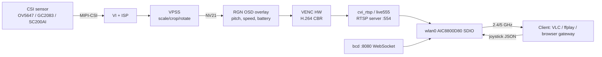

# 02 – Video streaming over Wi-Fi (and the teleoperation link)

Goal: first-person-view (FPV) video from the robot to a phone/PC over Wi-Fi, plus a low-latency
control/telemetry channel, **without disturbing the 200 Hz balance loop**.

Short answer to "does the design support streaming video to Wi-Fi?": **yes, entirely on the A53/Linux
side, using components that are already in the SDK image** (camera pipeline `cvi_mpi`, RTSP server
`cvi_rtsp`, AIC8800 Wi-Fi driver, `wpa_supplicant`, `iw`, `iperf3`, `dnsmasq`). The C906L is not involved
in video at all. What is *new work* is gluing it together, teleop/telemetry (`bcd`), and verifying that
video load does not add control jitter.

Legend: **[now]** exists in the tree, **[plan]** to build, **[est]** to be measured.

---

## 1. Why video stays on Linux

| Option | Verdict |
|--------|---------|
| ISP/VENC on the C906L (the "fast image" path: `FAST_IMAGE_ENABLE`, `prvISPRunTask`, `prvVcodecRunTask`) | **Rejected.** It is built only when `CONFIG_FAST_IMAGE_TYPE > 0`; the balance image links `comm rgn audio balance_car` and needs the little core free for control. It also has no network stack. |
| Video on Linux (VI → ISP → VPSS → VENC → RTSP) | **Chosen.** Hardware H.264/H.265/MJPEG encoder, mature sample code (`cvi_mpi/sample/vio`, `sample/venc`, `cvi_rtsp/example/rtsp_server_video.cpp`). |
| Run the camera pipeline on the little core and hand frames over | Not needed; no benefit, high complexity. |

Coupling between video and balance is limited to **shared DDR bandwidth** and the **mailbox/shm
traffic** (tiny). That is why the test plan includes a jitter test with the encoder at full load
(test `PERF-03` in doc 05).

## 2. End-to-end pipeline



Components, all **[now]** unless noted:

| Stage | Component | Where in tree / image |
|-------|-----------|-----------------------|
| Sensor drivers and config | `cvi_mipi_rx.ko`, `snsr_i2c.ko`, `/mnt/data/sensor_cfg*.ini` (OV5647 J1/J2, GC2083, SC200AI, SC035HGS provided) | `device/generic/rootfs_overlay/duos/mnt/data`, `loadsystemko.sh` |
| ISP / VPSS / VENC | `cv181x_vi.ko`, `cv181x_vpss.ko`, `cv181x_vcodec.ko`, `cvi_vc_driver.ko` | `loadsystemko.sh` |
| Pipeline code | `cvi_mpi`, sample `sample_vio`, `sample_venc` | `cvi_mpi/sample/*` |
| RTSP server | `cvi_rtsp` (live555 based): `rtsp_server_video`, `rtsp_service`, `rtsp_server_mjpeg` | `cvi_rtsp/example`, built by `build_cvi_rtsp` in `build/envsetup_soc.sh` |
| OSD (telemetry overlay) | RGN module + `cvi_rtsp/service/isp_info_osd.cpp` shows how text is drawn | `cv181x_rgn.ko` |
| Wi-Fi | `aic8800_bsp.ko`, `aic8800_fdrv.ko`, firmware in `/mnt/system/firmware/aic8800/` | `duo-init.sh` loads both; DTS enables `&wifisd` and `&wifi_pin` |
| Station mode | `wpa_supplicant` (+CLI, WPA3), `iw`, `dhcpcd` | `milkv-duos-glibc-arm64-sd_defconfig` |
| AP mode | **not in defconfig** – needs `BR2_PACKAGE_HOSTAPD=y` (+ `dnsmasq`, already enabled, for DHCP) **[plan]** | |
| Diagnostics | `iperf3`, `iw`, `dropbear` (ssh) | defconfig |

## 3. Cameras: two CSI connectors, one active at a time

| | **J1 – 16-pin, 1.8 V** (ships with DuoS) | **J2 – 15-pin, Raspberry-Pi compatible** |
|---|---|---|
| Sensor | **GC2083** (2 MP, 10-bit, 30 fps) | **OV5647** (supported); IMX219 (**not in the SDK**, see below) |
| SDK config file | `sensor_cfg_GC2083.ini` (= default `sensor_cfg.ini`), also `sensor_cfg_OV5647_J1.ini` | `sensor_cfg_OV5647_J2.ini` |
| Sensor I2C | bus 3, address 0x37 (GC2083) / 0x36 (OV5647 on J1) | bus 2, address 0x36 |
| CSI lane pads (`lane_id` = clk, d0, d1) | 2, 0, 1 | 5, 3, 4 |
| MCLK / reset pin (U-Boot `cvi_board_init.c`) | `CAM_MCLK0` / `XGPIOA_2` | `CAM_MCLK1` / `XGPIOA_4` (`CAM_PD1`) |
| `mipi_dev`, `dev_num` | 0, 1 | 0, 1 |

The `lane_id` values come from the shipped `.ini` files; MCLK/reset/I2C from `build/boards/.../u-boot/cvi_board_init.c`.
Both connectors use different pads, I2C buses and reset lines, so they do not electrically conflict, and
the pipeline is configured for a single sensor (`dev_num = 1`), which matches "one at a time".

**Interaction with the robot hardware (changes from the earlier draft):**

* J2 uses CSI lane pad 4 = `PAD_MIPIRX4P/N`, the pins the firmware currently uses for the IMU's I2C1. The IMU
  moves to **I2C0** ([01 §2.1](01-system-architecture.md)). I2C2/I2C3 belong to the cameras and are not available to the RTOS.
* The RTOS must not configure `CAM_MCLK*`, `XGPIOA_2/4`, I2C2 or I2C3 (note: the HAL has `PINMUX_CAM0/CAM1/I2C3`
  helpers – never call them from the balance firmware).

### 3.1 Selecting the active camera

Policy: **one sensor configured and running; the other connector's sensor is held in reset** (drive its reset
line active, no MCLK) so it cannot disturb the bus or the CSI receiver.

| Mode | Behaviour |
|------|-----------|
| `auto` (default) | at boot, probe both sensor I2C buses (below); if exactly one answers use it; if both answer use `preferred` (default J1); if none, start without video |
| `j1` / `j2` | forced selection from `/mnt/data/bc_camera.conf` or `bcctl camera j1|j2` |

Implementation [plan] – `bc-camera` script run from `S97bc-video` **before** the pipeline starts:

```sh
# 1. probe (sensor held out of reset first; chip-id registers per datasheets – verify on hardware)
#    GC2083  bus 3 @0x37 : regs 0xF0/0xF1 = 0x20 0x83
#    OV5647  bus 2 @0x36 : regs 0x300A/0x300B = 0x56 0x47
#    IMX219  bus 2 @0x10 : regs 0x0000/0x0001 = 0x02 0x19      (only if a driver is added)
# 2. copy the matching ini over /mnt/data/sensor_cfg.ini
#      GC2083 -> sensor_cfg_GC2083.ini     OV5647@J2 -> sensor_cfg_OV5647_J2.ini
# 3. hold the unused sensor in reset via sysfs GPIO (XGPIOA_2 or XGPIOA_4; Linux number = 480 + n **[verify base]**)
# 4. start bc-video (VI/ISP/VENC/RTSP) with the selected sensor name
```

Switching camera at run time = stop `bc-video`, rewrite the ini, restart (a few seconds); no kernel module
reload should be needed since `snsr_i2c.ko`/`cvi_mipi_rx.ko` read the ini at pipeline start **[verify – if
not, reload those two modules]**. The robot keeps balancing during the switch (video is decoupled).

The unused connector must be empty or its sensor idle; hot-plugging a camera is not supported (reboot or
`bcctl camera rescan`).

### 3.2 Sensor support status

| Sensor | Status in this SDK | Work |
|--------|--------------------|------|
| GC2083 | supported (`cvi_mpi/component/isp/sensor/cv181x/gcore_gc2083`, ISP tuning present) | none |
| OV5647 | supported (`.../ov_ov5647`), J1 and J2 ini files exist | validate on J2 with the 15-pin cable |
| **IMX219** | **not present** (no sensor driver, `cmos`/`sensor_ctl`/tuning files) | port: sensor_ctl (I2C register tables for 1080p/720p 2-lane mode), `cmos.c` (AE/AWB/gain tables), `cmos_param.h`, ISP tuning (`cvi_tool` bin), `.ini`, build integration – ≈ 5–10 d **[est]**, optional, after OV5647 works |

Both sensors are 2-lane MIPI here; GC2083 outputs 10-bit RAW at 1920×1080@30, OV5647 at the `2M_30FPS_10BIT`
mode named in its ini file. Resolution profiles in §5 therefore cap at 1080p. Different sensors have
different ISP tuning and exposure behaviour: expect to re-check low-light frame rate, because slow shutters
drop fps and raise video latency.

## 4. Network topologies

| Mode | When | Setup | Pros / cons |
|------|------|-------|-------------|
| **STA** (robot joins an existing AP) | lab / home | `wpa_supplicant.conf`, DHCP | Simple; depends on infrastructure; roaming latency spikes |
| **AP** (robot is the access point, e.g. `balancebot-XXXX`, 192.168.50.1/24) | field, demos | `hostapd` + `dnsmasq`; fixed channel (5 GHz if supported) | Deterministic, no router; one client mostly; add `hostapd` to image |
| **USB-NCM/RNDIS** | bring-up, wired fallback | existing `usb-ncm.sh` / `usb-rndis.sh` in `/mnt/system` | Best latency, great for development and for benchmarking the pipeline without Wi-Fi |

Decision: develop over USB-NCM, validate on STA, ship **AP + STA fallback** (try STA for 15 s, else AP).

Radio settings to apply and verify on hardware **[est]**:

```sh
iw dev wlan0 set power_save off          # power-save adds 100+ ms latency bursts
iw dev wlan0 info; iw dev wlan0 link      # confirm band/width/rssi
# AP: prefer 5 GHz, 20 or 40 MHz, fixed channel without DFS; WMM on
# Mark video and control with DSCP so WMM maps to AC_VI / AC_VO:
#   RTSP RTP/UDP: DSCP AF41 (0x88)   control WebSocket/UDP: DSCP EF (0xB8)
```

The AIC8800D80 band/MIMO/throughput capabilities must be confirmed with `iw phy` on the actual board;
this document does not assume anything beyond "SDIO, works with the provided `aic8800_fdrv`".

## 5. Video parameters

Targets for FPV, not recording. Latency matters more than quality. **[est]** values come from typical
H.264 behaviour and must be validated by the measurements in §9.

| Profile | Resolution / fps | Codec | Rate control | Bitrate | GOP | Use |
|---------|------------------|-------|--------------|---------|-----|-----|
| `fpv-low` (default) | 640×360 @ 20 | H.264 baseline/main | CBR | 600–800 kb/s | 20 (1 s) | weak Wi-Fi |
| `fpv-med` | 1280×720 @ 25 | H.264 main | CBR | 1.5–2.5 Mb/s | 25 | normal |
| `fpv-hq` | 1920×1080 @ 25 | H.264/H.265 | VBR capped | 3–4 Mb/s | 50 | demo, good link |
| `mjpeg` | 640×480 @ 15 | MJPEG | – | 3–6 Mb/s | – | trivial browser display, no inter-frame dependency |

Latency-oriented encoder settings **[plan]**:

* no B-frames (`VENC_GOPMODE_NORMALP`, as in `rtsp_server_video.cpp`), small GOP, SPS/PPS repeated on
  every IDR;
* CBR with a short VBV window (≈ 1 frame) to avoid bursts that overflow the Wi-Fi queue;
* frame rate halved automatically when the Wi-Fi retry rate rises (see §7, adaptive rate);
* IDR on demand when a client connects or after packet loss (RTSP `PLI`-like behaviour via the
  `CVI_VENC_RequestIDR` call present in `cvi_mpi/sample/venc`).

## 6. Software structure on Linux [plan]

```
/usr/bin/bc-video      – wraps cvi_rtsp example: VI→VPSS→VENC→RTSP, reads /mnt/data/bc_video.json
/usr/bin/bcd           – teleop + telemetry + params daemon (below)
/etc/init.d/S90bc-net  – wifi (STA→AP fallback), power-save off, DSCP rules
/etc/init.d/S95bc-rtos – rproc load (dev) / wait for RTOS init-done, push params
/etc/init.d/S96bcd     – start bcd
/etc/init.d/S97bc-video– start bc-video
```

Start order matters: **RTOS and `bcd` first, video last**, so the robot is controllable even if the
camera pipeline fails to start (e.g. sensor missing). A failed `bc-video` must never stop `bcd`.

### 6.1 `bcd` – balance control daemon

| Responsibility | Mechanism |
|----------------|-----------|
| Command path to RTOS | `/dev/cvi-rtos-cmdqu` ioctl `RTOS_CMDQU_SEND` with `ip_id = IP_BALANCE` ([01 §6.1](01-system-architecture.md)) |
| Telemetry from RTOS | mmap `bc_shm` (UIO or `/dev/mem` in dev), read ring, convert units |
| Client protocol | WebSocket on TCP 8080 (single control client at a time, others read-only) |
| Heartbeat | `BC_CMD_HEARTBEAT` at 10 Hz; monitors `rtos_heartbeat` |
| Safety filter | clamps speed/turn, applies accel limit, enforces *dead-man*: no client message for 300 ms → send zero target |
| Persistence | `/mnt/data/bc_params.json`, validated against the ranges in [01 §6.4](01-system-architecture.md) |
| Logging | rotating JSONL of the telemetry ring on SD (optional) |

Implementation language: C (small, no dependencies, easy to cross-compile with the existing
toolchain) or Python 3 (present in the image; adequate at 50 Hz). Start with Python for the protocol
and UI, move hot paths to C only if CPU measurements demand it.

### 6.2 Client protocol (WebSocket, JSON text frames)

Client → robot (20–50 Hz while a stick is active):

```json
{"t":"ctl","seq":1234,"v":0.30,"w":-0.8,"dead_man":true}
```

`v` m/s (forward +), `w` rad/s (counter-clockwise +). Values are clamped by `bcd` to
`v_max_mps` / `w_max_rads` and rate-limited to `acc_max_mps2` before being forwarded.

Other client → robot messages:

| Message | Fields | Effect |
|---------|--------|--------|
| `{"t":"arm"}`, `{"t":"disarm"}`, `{"t":"estop"}` | – | commands (acknowledged in `state` events) |
| `{"t":"param","k":"a_kp","v":15.0}` | key, value | validated, pushed to RTOS, acked |
| `{"t":"calib","what":"gyro"}` | – | runs gyro bias calibration (robot must be still) |
| `{"t":"video","profile":"fpv-low"}` | – | restarts encoder with new profile |

Robot → client:

```json
{"t":"tel","ts":123456,"pitch":0.42,"gyro":-1.3,"vl":0.01,"vr":0.02,"u":-3.1,
 "state":"BALANCING","fault":0,"cpu":11,"vbat":11.8,"rssi":-52,"lost":0}
```

at 20 Hz (decimated from the 50 Hz ring), plus event messages (`state`, `fault`, `param_ack`).

Transport choice: WebSocket over TCP is acceptable for control **because the RTOS does not depend on
it** (a stalled TCP connection only freezes the commanded velocity, which the dead-man timer turns
into a stop). If measurements show head-of-line blocking under loss, add an optional UDP control
channel with the same JSON/CBOR payload and sequence numbers (drop old, never retransmit).

### 6.3 Telemetry overlay on video (optional)

Draw pitch, speed, state, battery and RSSI into the stream with the RGN OSD (same mechanism as
`isp_info_osd.cpp`) so a recorded video is self-explanatory. Cost: negligible CPU, one text region
update at ≤ 5 Hz. Do not overlay anything the operator needs for safety – the web UI shows it
independently of the video.

## 7. Handling a bad link

| Condition | Detection | Response |
|-----------|-----------|----------|
| Video client gone | RTSP teardown / no RTCP | stop encoder for the profile (saves A53/DDR); robot unaffected |
| Control client gone | no WebSocket frame for 300 ms | target (v, w) → 0 in `bcd` |
| `bcd` crashed/hung | RTOS: no heartbeat for 500 ms | RTOS zeroes targets itself (keeps balancing) |
| Wi-Fi drops for > 5 s | `bcd` link monitor | log; robot stands still; optional auto-disarm after `hb_disarm_ms` or on low battery |
| High retry/loss | `iw dev wlan0 station dump` retry %, RTCP loss | adaptive: halve fps, then drop to `fpv-low`; recover after 10 s of clean link |
| A53 overloaded | `bcd` measures loop lateness | reduce telemetry rate; never touches RTOS timing |

## 8. Performance budgets **[est]**

| Metric | Target | How measured |
|--------|--------|--------------|
| Glass-to-glass video latency, `fpv-low`, good link | ≤ 250 ms (stretch 150 ms) | timestamp overlay + phone camera filming screen and a clock (test `VID-02`) |
| Control round trip (client → RTOS → telemetry back) | ≤ 60 ms p95 | `ping` field in `ctl`/`tel` (test `NET-02`) |
| Mailbox command latency Linux → RTOS handler | ≤ 1 ms p99 | RTOS timestamps in event log vs Linux `clock_gettime` (test `IPC-02`) |
| Balance-loop jitter with video @ 720p25 + Wi-Fi iperf3 at full rate | period within 5 ms ± 0.1 ms p99, no deadline misses in 30 min | `period_us` in telemetry (test `PERF-03`) |
| Sustained video+telemetry throughput | video bitrate + < 100 kb/s telemetry | `iperf3`, `iw station dump` |
| A53 CPU load for `bc-video` + `bcd` | < 60 % of one core | `top`, `/proc/stat` |

## 9. Implementation tasks

| ID | Task | Depends on | Done when |
|----|------|------------|-----------|
| V0 | `bc-camera` probe/select script, reset-hold of the unused sensor, J1 (GC2083) and J2 (OV5647) validated separately, switching test | IMU moved off `MIPIRX4` |
| V1 | Bring up camera + `rtsp_server_video` on DuoS with `fpv-med`; verify with `ffplay rtsp://…` | V0 | stable 10 min, fps and bitrate logged |
| V2 | Validate Wi-Fi: STA connect script, `iw` power-save off, `iperf3` baseline TCP/UDP both directions | V1 optional | throughput and loss numbers recorded in `docs/balance_car/results/` |
| V3 | Add `hostapd` to defconfig; AP bring-up script; STA→AP fallback | V2 | phone connects to robot AP, DHCP works |
| V4 | Profile loader (`bc_video.json`) + adaptive rate | V1 | `fpv-low/med/hq` switchable at run time |
| V5 | `bcd` skeleton: WebSocket, dead-man, telemetry from stub shm | – | works against a fake RTOS (host test, see doc 05) |
| V6 | Web UI (single HTML page served by `bcd`): joystick, gauges, video via MJPEG `` first; WebRTC gateway later | V5 | phone browser can drive and see telemetry |
| V9 | (optional) IMX219 sensor driver + tuning for J2 | V0 |
| V7 | OSD overlay | V1 | pitch/state visible in stream |
| V8 | Jitter test with all of the above running | RTOS shm telemetry | `PERF-03` passes |

## 10. Risks

| Risk | Impact | Mitigation |
|------|--------|-----------|
| Camera J2 (15-pin) and the current IMU pads share `PAD_MIPIRX4P/N` (R1, doc 01) | J2 unusable or no IMU | Move IMU to I2C0 (confirm header pins + clock gates); until then only J1 works |
| IMX219 has no driver in the SDK | 15-pin connector limited to OV5647 | optional sensor port (§3.2) |
| Wrong sensor ini for the connected camera | pipeline fails to start | `auto` probe before start; `bcd` reports camera state |
| `cv181x_pwm.ko` loaded by `duo-init.sh` also drives PWM0 | Motor glitches/conflict | Remove `insmod` or keep the channels unexported; verify with `/sys/class/pwm` |
| DDR contention from VENC/VPSS stretches I2C/PWM timing on the C906L | Control jitter | Measure (`PERF-03`); if needed lower resolution/fps, or move critical code to SRAM if available |
| Wi-Fi driver is out-of-tree (AIC8800) | Kernel upgrade pain | Pin kernel 5.10; keep modules in `osdrv/extdrv/wireless` |
| Buffer bloat in Wi-Fi queue | Latency spikes | CBR, short VBV, DSCP/WMM, `fq_codel` if available |
| Live555/RTSP adds buffering | Latency | Evaluate MJPEG-over-HTTP or WebRTC (WHEP) gateway for lower latency |
