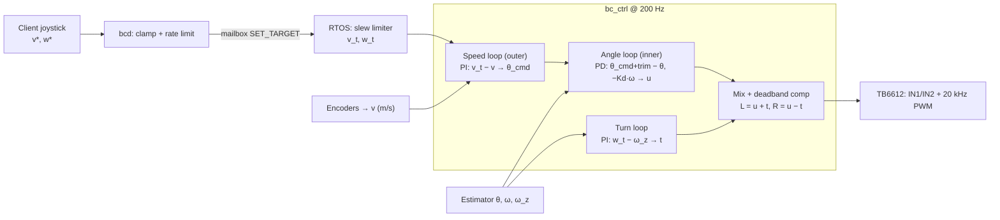

# 04 – Balance algorithm, PID cascade and motion control

How the car stays upright, how speed and turning are commanded, how the controller is tuned, and what
in the shipped firmware has to change.

Legend: **[now]** in `freertos/cvitek/task/balance_car`, **[plan]** proposed, **[sim]** reproduced in the
host simulation (`test/`, doc 05), **[est]** assumption to verify on hardware.

> **Read this first.** A closed-loop simulation of the shipped firmware logic (real `pid.c` and
> `mpu60x0.c` driven against a wheeled-inverted-pendulum plant) found that the **shipped speed-loop
> gains/sign and the 0.98 complementary filter do not balance in simulation** (§9, test
> `sim_KNOWN_DEFECT_*`). The recommended parameters in this document do. The plant is a model with
> *assumed* parameters; the verdict must be confirmed on the real chassis, but the structural problems
> (sign, units, accel contamination) do not depend on the exact numbers.

---

## 1. Control structure



* **Angle loop** (fast, inner) is what keeps the car upright. Unstable plant → must be stabilised first.
* **Speed loop** (slow, outer) makes the car stand still / drive at a commanded speed by commanding a
  *lean angle* (a leaning inverted pendulum accelerates toward its lean).
* **Turn loop** is independent: a differential command around the common drive.

**[now]**: angle PID (`Kp 25, Ki 0, Kd 0.8`) fed by speed PID (`Kp 0.05, Ki 0.01`, output clamp ±15°);
`g_target_turn` is added/subtracted but nothing ever sets it; no yaw feedback; no command interface.

## 2. Physics (why the numbers are what they are)

Linearised wheeled inverted pendulum, small angle, with wheel acceleration `a = b·u` (`u` = motor %,
`b` [m/s² per %] lumps motor, gearbox, wheel and mass):

```
θ'' = (g/l)·θ + (b/l)·u            (θ in rad; sign convention per §7)
```

| Symbol | Meaning | Assumed value **[est]** |
|--------|---------|-------------------------|
| `l` | height of centre of mass above axle | 0.10 m |
| `b` | wheel acceleration per percent motor drive | 0.05 m/s² per % (≈ 4.5 m/s² at 90 %) |
| Open-loop pole | `±√(g/l) = ±9.9 rad/s` | → falls over (error doubles) in `ln2/9.9 ≈ 70 ms` |
| Actuator lag | motor + driver | 20 ms first order |
| Deadband | static friction / back-EMF | 6 % of full drive |

Consequences:

1. **Loop rate.** An unstable pole at 9.9 rad/s needs a control bandwidth several times larger and a
   sample rate ≥ 20× the pole frequency: 200 Hz (≈ 32× the pole) is right; jitter up to ±1 ms is harmless,
   a *missed* cycle (5 ms) costs ≈ 5 % growth of the error – three in a row is not.
2. **Minimum Kp.** With `u = −Kp·θ − Kd·ω` the closed loop is
   `θ'' = (g/l − bKp/l)θ − (bKd/l)ω`. Stability needs `b·Kp > g` →
   **`Kp > g/b = 196 %/rad = 3.4 %/°`**. Anything lower cannot hold the car regardless of Kd.
3. **Design point (recommended `Kp = 15 %/°`, `Kd = 0.8 %/(°/s)`):**
   `Kp = 859 %/rad → bKp/l = 430`, `ω_n = √(430 − 98) = 18.2 rad/s (2.9 Hz)`;
   `Kd = 45.8 %/(rad/s) → bKd/l = 22.9 = 2ζω_n → ζ = 0.63` – a well-damped, ≈ 2× faster-than-pole loop,
   leaving ≈ 4.4× margin over the minimum Kp (and tolerating a plant gain `b` 4× lower, which covers
   uncertainty in battery sag, wheels and mass). **[sim]**: stable for `b = 0.02 … 0.2`.
4. **Saturation sets the recoverable lean.** Max wheel acceleration `b·u_max = 4.5 m/s²`; holding a lean
   `θ` needs `a = g·tanθ`, so the maximum *recoverable* static lean is
   `atan(4.5/9.81) = 24.6°` (≈ 23° after the 6 % deadband). The fall limit of 45° is therefore a
   "definitely gone" threshold, not a recovery limit. Practical corollary: `Kp = 15` saturates the output at
   `90/15 = 6°` of error – large pushes are handled by the saturation, not by linear control.
5. **Minimum phase vs not.** To accelerate forward the car must first drive *backwards* under itself (to
   lean forward). The speed loop therefore has a non-minimum-phase zero and must be kept ≥ 5–10× slower
   than the angle loop (§3).

## 3. Controller definitions

All quantities per control cycle `k`, `dt` measured (not assumed). Signs per §7.

### 3.1 Angle loop (inner) [plan]

```
θ_set = trim_deg + θ_cmd                       (θ_cmd from the speed loop)
u     = Kp·(θ_set − θ) − Kd·ω                  (ω = filtered gyro rate; derivative on MEASUREMENT)
u    += Ki·∫(θ_set − θ)dt                      (normally Ki = 0 – the speed-loop integral trims)
u     = clamp(u, ±out_max)                     (out_max = 90 %)
```

Why derivative on the gyro rate instead of differentiating the error:

| Differentiating error **[now]** | Using `ω` **[plan]** |
|---------------------------------|----------------------|
| Setpoint steps (from the speed loop or the joystick) cause a **derivative kick** – verified by test `pid_setpoint_step_causes_derivative_kick` (output > 900 for a 5-unit step with Kd = 1, dt = 5 ms) | No kick: `ω` is a measurement and is continuous |
| Noise amplified by `1/dt` (200×) on a quantised angle | Gyro is already a rate with its own DLPF |
| Needs a low-pass to be usable | Delay is the sensor DLPF only |

`pid.c` keeps its generic `pid_update(sp, meas, dt)` for the speed/turn loops; add
`pid_update_dterm(pid, sp, meas, rate, dt)` (derivative from the externally supplied rate) for the angle loop.

### 3.2 Speed loop (outer) [plan]

```
v_err   = v_t − v_f                              (m/s, v_f = low-passed wheel speed, §03 4.4)
θ_cmd   = Kv_p·(v_f − v_t) + Kv_i·∫(v_f − v_t)dt        (deg; note the sign – §7)
θ_cmd   = clamp(θ_cmd, ±v_max_deg);   integral clamped separately (anti-windup, §3.5)
```

Equivalently in the firmware's `pid_update(setpoint = v_t, measurement = v)` form the gains are
**negative** under the sign convention in §7.

Units. The shipped code feeds the loop with **counts/s** and uses `Kp = +0.05`; with the 19 390 counts/m of
the reference chassis that is `0.05 × 19 390 ≈ 970 °/(m/s)` – five hundred times larger than useful – and
the output clamp of ±15° is reached at 0.015 m/s of speed error. Convert to m/s first:

| Quantity | Value |
|----------|-------|
| recommended `Kv_p` | **1.94 °/(m/s)** (= 1·10⁻⁴ ° per count/s on the reference chassis) |
| recommended `Kv_i` | **1.94 °/m** |
| clamp `v_max_deg` | 8° (≈ 1.4 m/s² of lean-induced acceleration) |

Reasoning: for the inner loop much faster than the outer, `v' ≈ g·(π/180)·θ_lean`, so the outer loop is a
first-order system `v' = −λ(v − v_t)` with `λ = g·(π/180)·Kv_p = 0.171·Kv_p`.
`Kv_p = 1.94 → λ = 0.33 s⁻¹` (τ ≈ 3 s): gentle, far below `ω_n = 18 s⁻¹`; the integral term removes the
residual lean from the CoG offset and drift. Raising `Kv_p` to ≈ 4 gives τ ≈ 1.5 s (stiffer position holding);
in the simulation the speed loop is stable at 5.8 °/(m/s) and diverges at 7.8 **[sim]**, so stay ≤ 4
(≥ 2× margin to the divergence in the model) and keep the speed loop below ≈ 1/10 of `ω_n`.

The speed loop may run at 50 Hz (every 4th cycle); at 200 Hz it is fine too.

### 3.3 Turn loop [plan]

```
w_err = w_t − ω_z                       (ω_z from gyro Z, bias-corrected; rad/s)
t     = Kt_p·w_err + Kt_i·∫w_err dt     (% ; defaults Kt_p = 5, Kt_i = 5)
t     = clamp(t, ±t_max)  with  t_max = 20 %  scaled by  1/(1 + |v|/0.5)
```

`yaw'' ≈ 2·b·t / track` (track ≈ 0.17 m): 10 % differential gives ≈ 5.9 rad/s² **[est]**; `Kt_p = 5`
puts the yaw-rate time constant near 0.35 s. Using the gyro (not encoder difference) avoids wheel-slip and
quantisation problems; encoders are a slow fall-back. Without feedback (**[now]**) the same joystick
input produces different turn rates with battery and floor.

### 3.4 Mixing and actuator mapping

```
L_cmd = u + t          R_cmd = u − t              (signs: s_L·, s_R· motor sign macros)
dz-compensation:       m = sgn(x)·( dz + |x|·(100 − dz)/100 )   for |x| > 0.5 %, else 0
battery scaling:       m ← m · V_nom / V_bat                    (optional once an ADC is wired)
clamp:                 |m| ≤ MAX_MOTOR_PCT (90 %)
```

TB6612FNG truth table used by `tb6612.c`:

| IN1 | IN2 | PWM | Result |
|-----|-----|-----|--------|
| 1 | 0 | duty | forward, speed ∝ duty |
| 0 | 1 | duty | reverse |
| 0 | 0 | – | stop / coast (**[now]** `tb6612_coast`, `duty = 0`, PWM disabled) |
| 1 | 1 | 100 % | short brake (`tb6612_brake`) – avoid while balancing; use only on ESTOP if desired |
| STBY = 0 | | | outputs high-Z (hard coast) – used by FAULT/DISARM |

PWM: 20 kHz (`BC_PWM_PERIOD_NS = 50 000`), 100 MHz PWM clock → `period = 5 000` ticks → 0.02 % resolution; far
above audible range and well above the motor's electrical time constant. Direction pins are written
*before* the duty so a reversal never briefly drives the old direction at the new duty (**[now]** order in
`set_side()` is correct). Known quirk (`hw_pwm_enable()`): every duty update stops and restarts the channel
(`pwmstart` cleared then set) – at 200 Hz this restarts the PWM period 200×/s; harmless on a motor, but
visible on a scope as a once-per-5 ms shortened/lengthened pulse. Fix by writing the new HLPERIOD/PERIOD and
triggering `PWMUPDATE` when the channel is already running **[plan, low priority]**.

### 3.5 Anti-windup, rate limits, saturation

* Integrators: clamp to their own limit (`i_max`) **independent of `out_max`** – today `pid_init` sets
  `i_min/i_max = out_min/out_max`, which lets the I-term alone consume the full output; host test
  `pid_integral_accumulates_and_is_clamped` pins the current behaviour.
* Freeze (don't integrate) while the output is saturated or the state ≠ `BALANCING`.
* Reset all integrators on state change into `BALANCING` and on any fault.
* **Setpoint slew limiter** on `v_t` (`acc_max_mps2` = 0.5) and `w_t` (`3 rad/s²`): joystick steps become
  ramps, so the speed loop never demands a lean the actuators cannot recover from.

## 4. Movement control – from finger to wheel

| Step | Where | What |
|------|-------|------|
| 1 | Client | joystick → `{"t":"ctl","v":0.30,"w":-0.8}` at 20–50 Hz |
| 2 | `bcd` | clamp `|v| ≤ v_max (0.5 m/s)`, `|w| ≤ w_max (2 rad/s)`; dead-man: no frame for 300 ms → 0 |
| 3 | mailbox | `BC_CMD_SET_TARGET`: `int16 mm/s` \| `int16 mrad/s` in `param_ptr` ([01 §6.1](01-system-architecture.md)) |
| 4 | RTOS `bc_comm` | validate, store as single-writer command snapshot; heartbeat watchdog zeroes it if Linux stalls |
| 5 | RTOS `bc_ctrl` | slew-limit → speed loop → angle loop; turn loop; mix |
| 6 | Driver | direction pins, PWM duty |

Behaviours:

| Command | Mechanism |
|---------|-----------|
| **Stand still** | `v_t = 0`: speed integral pulls the car back to zero speed; position hold (optional) adds `Kx·(x − x_hold)` to the speed command |
| **Forward/backward** | `v_t ≠ 0` → speed loop leans the car; steady speed ≈ constant lean `θ ≈ a_drag/g` |
| **Stop** | ramp `v_t → 0` at `acc_max`; the car leans back to decelerate (never an instant brake) |
| **Turn in place** | `v_t = 0`, `w_t ≠ 0` → equal and opposite wheel drive; the angle loop still balances |
| **Arc** | both `v_t`, `w_t`; turn authority shrinks with speed |
| **Drive distance / pivot angle** (later) | RTOS integrates `x`/`ψ` and ramps down; commanded as `BC_CMD_MOVE` |
| **Pick-up / push recovery** | lift detection (wheel speed ≫ with small pitch) → coast; pushes handled by saturation up to ≈ 23° |
| **Fall** | `|θ| > 45°` → coast, `STBY = 0`; re-arm only after upright and still |

Kinematics (for odometry and the mixer): `v = (v_R + v_L)/2`, `ω = (v_R − v_L)/track`; wheel speed
`v_i = Δc_i/dt / (counts_per_rev/(π·D))`.

## 5. State machine and safety hooks

State machine, faults and watchdogs are specified in [01 §7](01-system-architecture.md). Control-specific
rules:

* PID outputs reach the motors **only in `BALANCING`**. In every other state both sides are forced to coast.
* `ARMING` requires `|θ − trim| < 3°` and `|ω| < 10 °/s` for 1 s so the robot is never armed while falling.
* Saturation for longer than `sat_ms` (300 ms) → fault (the loop is not coping: mis-tuned, wrong sign, or dead battery).
* Heartbeat loss does **not** disarm (it would drop the car); it zeroes the targets.

## 6. Reference implementation sketch [plan]

```c
void bc_ctrl_step(bc_ctx_t *c)
{
    uint32_t t = timer_us();
    float dt = clampf((t - c->t_prev) * 1e-6f, 0.002f, 0.010f);  c->t_prev = t;

    if (imu_read(&c->raw) != 0) { fault_imu(c); goto actuate; }  /* → coast, never "continue" */
    est_update(&c->att, &c->raw, &c->cal, dt);                   /* θ, ω, ω_z */
    enc_update(&c->wheels, dt);                                   /* v_l, v_r, v, v_f, x */
    cmd_snapshot(&c->cmd);                                        /* watchdog applied */
    state_update(c);                                              /* safety checks */

    if (c->state == ST_BALANCING) {
        slew(&c->v_t, c->cmd.v, ACC_MAX*dt);  slew(&c->w_t, c->cmd.w, ALPHA_MAX*dt);
        float th_cmd = pi_update(&c->pid_v, c->v_t, c->wheels.v_f, dt);        /* negative gains */
        float u      = pd_update(&c->pid_a, c->trim + th_cmd, c->att.theta, c->att.omega, dt);
        float turn   = pi_update(&c->pid_w, c->w_t, c->att.omega_z, dt) * turn_scale(c->wheels.v_f);
        c->out_l = shape(u + turn);  c->out_r = shape(u - turn);   /* deadband, clamp */
    } else { c->out_l = c->out_r = 0; reset_integrators(c); }

actuate:
    motors_apply(c->state == ST_BALANCING, c->out_l, c->out_r);   /* STBY, IN pins, PWM */
    telemetry_tick(c);
}
```

All functions except `imu_read`, `motors_apply` and the timer are pure and run on the host in CI.

## 7. Sign conventions and bring-up check (do this before any floor test)

The control law requires: **positive angle ⇒ output negative ⇒ the wheels move toward the side the car is
leaning**. Three independent signs decide whether that holds and each can be wrong:

| Macro **[plan]** | What it flips | Symptom if wrong |
|------------------|---------------|------------------|
| `BC_IMU_SIGN` / axis map | sign of θ and ω together | car drives away from the lean and falls instantly |
| `BC_MOTOR_SIGN_L/R` | motor direction (wiring order of OUT1/OUT2) | one wheel pushes the wrong way → spins in circles / falls sideways |
| `BC_ENC_SIGN_L/R` | encoder count direction | balances for a moment, then the speed loop adds positive feedback and the car runs away (this is what `sim_wrong_speed_sign_diverges` demonstrates: runs away > 5 m or falls) |

Bench procedure (wheels off the ground, battery connected, car held):

1. **Encoders:** disarmed, spin each wheel by hand in the direction you consider *forward*. Both
   `enc_*` increase. If not, flip `BC_ENC_SIGN_*`.
2. **Motors:** command `+20 %` per side from the debug shell. Each wheel turns *forward* **and** its
   encoder counts up. If the wheel turns backward flip `BC_MOTOR_SIGN_*` (or swap OUT1/OUT2).
3. **IMU:** `ARM` with the car held upright, then **tilt it slowly forward by hand**: wheels must spin forward
   (toward the lean) with increasing speed; tilt back → wheels spin backward. If reversed flip `BC_IMU_SIGN`.
4. **Speed loop:** hold the car upright and spin one wheel forward by hand while balancing is active; the
   controller must respond by trying to lean *back* (wheels first accelerate forward, then reverse). With
   the car hand-held you feel a pull *opposing* the motion. If it pulls *along* with it, the speed-loop
   sign (or `BC_ENC_SIGN`) is wrong.

Record the final signs in `board_pins.h` and in `results/signs-<chassis>.md` (see doc 06 for artefact
conventions).

## 8. Tuning procedure

Prerequisites: signs verified (§7), gyro calibrated, level trim set, fresh battery (≥ 90 %), car on a
stand or tethered with a light line to a gantry.

| Step | Do | Pass / next |
|------|----|-------------|
| 1 | Speed loop off (`Kv_p = Kv_i = 0`), turn off, `Kd = 0`, `Kp = 5` | If the car "tries" to stand (pushes toward the lean) the signs are right |
| 2 | Increase `Kp` in steps of 2 until the car holds itself but oscillates ≈ 2–4 Hz | Note this `Kp_crit` (expect 8–20) |
| 3 | Set `Kp = 0.6–0.7·Kp_crit`; raise `Kd` from 0.2 in steps of 0.1 until the oscillation is damped | Stop when a high-frequency buzz appears (`Kd` too high / noise); back off 20 % |
| 4 | Apply small pushes: recover in < 1 s, overshoot < 3°, no sustained ringing | else adjust `Kd` |
| 5 | Re-trim `trim_deg` until the car stays in place on its own for 5 s | |
| 6 | Enable speed loop with `Kv_p = 1`, `Kv_i = 1`, clamp 5° | Car should settle to rest within ≈ 5 s after a push |
| 7 | Raise `Kv_p` to 2–4 while watching for slow (0.3–1 Hz) oscillation; reduce if present | |
| 8 | Enable turn loop, command ±1 rad/s | yaw rate tracks within 10 %, no balance disturbance |
| 9 | Repeat steps 4–8 with a half-charged battery and with 100 g extra payload | gains must work across the envelope, otherwise add battery scaling |

Troubleshooting:

| Symptom | Likely cause | Fix |
|---------|--------------|-----|
| Falls instantly in one direction, wheels move *away* from the lean | IMU/motor sign | §7 |
| Buzzing / hot motors at rest | `Kd` too high, gyro noise, DLPF too wide, deadband compensation too large | lower `Kd`, DLPF 42 Hz, reduce `dz` comp |
| 2–4 Hz oscillation growing | `Kp` too high or `Kd` too low, or loop jitter | lower `Kp`, raise `Kd`, check `jitter_us` |
| Slow 0.3–1 Hz weave | speed loop too aggressive | lower `Kv_p`/`Kv_i` |
| Slowly drifts one way | trim off, gyro bias wrong, speed-loop I too small | recalibrate, `Kv_i ↑` |
| Falls when starting/stopping | no slew limiter, `acc_max` too high | lower `acc_max`, add slew |
| Works on the stand, fails on the floor | wheel slip/deadband, battery, accel contamination | check `pitch` vs `pitch_acc` in telemetry; lower accel weight / enable gate |
| Spins in circles | one motor sign wrong, or `ω_z` bias | §7, recalibrate gyro Z |
| Runs away after a minute | gyro bias drift, speed-loop sign | enable bias tracking, §7 step 4 |

## 9. Findings on the shipped firmware (with simulation evidence)

| ID | Finding | Evidence | Fix |
|----|---------|----------|-----|
| C1 | Speed loop gain `+0.05` in °/(counts/s) is the **wrong sign and ≈ 500× too large** for the angle convention required in §7; output clamp ±15° is reached at 0.015 m/s error | `sim_KNOWN_DEFECT_shipped_config_falls` (whole shipped config falls by ≈ 0.35 s), `sim_KNOWN_DEFECT_shipped_speed_gains_fall_even_with_good_estimator` (wrong sign), `sim_speed_gain_magnitude_matters_not_just_sign` (right sign, same magnitude still diverges) | §3.2 gains, units in m/s |
| C2 | Complementary filter `α = 0.98` trusts accelerometer contaminated by wheel acceleration | `sim_KNOWN_DEFECT_shipped_filter_falls_even_without_speed_loop` (speed loop disabled, still falls) | §03 3.2 |
| C3 | Angle `Kp = 25` saturates the 90 % output at 3.6° error | arithmetic | `Kp ≈ 15` with the improved filter; verify on chassis |
| C4 | `dt` assumed 5 ms | code | measured `dt` |
| C5 | Derivative on error → kick on setpoint changes | `pid_setpoint_step_causes_derivative_kick` | derivative on gyro rate |
| C6 | I-term limit equals output limit | `pid_integral_accumulates_and_is_clamped` | separate `i_max`, freeze when saturated |
| C7 | No turn control, no command path (`g_target_*` are never written) | code | §3.3, doc 01 §6 |
| C8 | IMU read failure leaves PWM at last value | code (`continue`) | coast on any IMU fault (doc 03 §6) |
| C9 | Boot arms immediately; filter starts at θ = 0 | code | `IDLE` + arm check; init θ from accel |
| C10 | No deadband compensation (6–10 % dead zone is typical for N20/37-520 geared motors) | sim shows limit cycle ±1–2° | §3.4 |

## 10. Parameter reference (defaults = simulation-derived starting point)

| Name | Unit | Default | Range | Tune order |
|------|------|---------|-------|------------|
| `a_kp` | %/° | 15 | 3.5–40 | 2 |
| `a_kd` | %/(°/s) | 0.8 | 0–3 | 3 |
| `a_ki` | %/(°·s) | 0 | 0–2 | – |
| `trim_deg` | ° | 0 | ±10 | 5 |
| `out_max` | % | 90 | 30–100 | – |
| `v_kp` | °/(m/s) | 1.94 | 0–6 | 6–7 |
| `v_ki` | °/m | 1.94 | 0–6 | 6–7 |
| `v_max_deg` | ° | 8 | 2–15 | – |
| `v_filter` | – | 0.3 | 0.05–1 | – |
| `t_kp`, `t_ki`, `t_max` | %/(rad/s), %/m, % | 5, 5, 20 | | 8 |
| `deadband_pct` | % | 6 | 0–15 | measured with bench ramp |
| `acc_max`, `alpha_max` | m/s², rad/s² | 0.5, 3 | | |
| `v_max`, `w_max` | m/s, rad/s | 0.5, 2 | | |
| `fall_deg`, `sat_ms` | °, ms | 45, 300 | | |

## 11. Validation hooks

| What | Where |
|------|-------|
| PID mathematics (P, clamp, I and anti-windup, D, reset, dt safety) | `test_pid.c` (7 tests) |
| Closed loop: recommended configuration balances for plant gains 0.02–0.2 m/s²/%, tolerates sensor noise, recovers from a 34 °/s push, starts from 12° lean | `test_sim.c` |
| Wrong speed-loop sign diverges (guards §7); gain magnitude limit; stable up to 3.9 °/(m/s) | `sim_wrong_speed_sign_diverges`, `sim_speed_gain_magnitude_matters_not_just_sign`, `sim_speed_loop_stable_up_to_4_deg_per_mps` |
| Shipped configuration falls (pins the defect until fixed) | `sim_KNOWN_DEFECT_*` |
| Hardware | `HIL-*`, `FLD-*` in doc 05 |

Simulation plant: 0.10 m CoM height, `b = 0.05`, 6 % deadband, 20 ms actuator lag, 200 Hz loop, accelerometer
includes the wheel acceleration, optional uniform noise; code in `test/sim_plant.c`. **These are assumed
values; replace with a system-identification result (§12) before trusting margins.**

## 12. System identification (to replace the assumptions)

1. **Motor/actuator gain `b` and deadband:** wheels on the ground, car lying on a support, step `u` = 10 %…60 %,
   log wheel speed at 200 Hz; `b` = slope of acceleration vs `u`, deadband = intercept.
2. **CoM height `l`:** hang the car by the axle and measure the pendulum period `T = 2π√(l_eff/g)`
   (physical pendulum – account for inertia) or run the free-fall test and fit.
3. **Encoder constants:** roll 1 m, read counts → `counts_per_m`; spin in place 10 rotations → `track`.
4. **Gyro scale:** rotate 360° on a turntable, compare to ∫gyro.
5. Feed the numbers back into `sim_plant.c` and re-run the sweep; update default gains.
